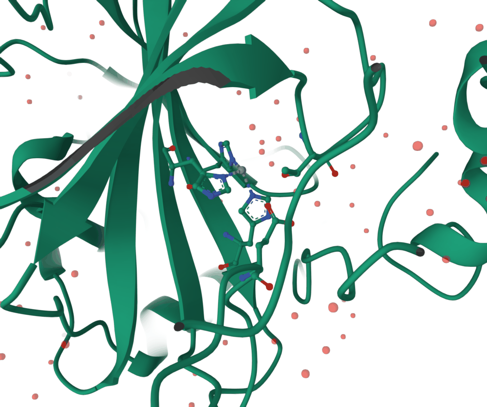

# protean

Agent-native molecular visualization. An MCP server (Python) drives a
[Mol\*](https://molstar.org) viewer in a browser tab — a model does the
driving, you watch and tweak.



*"Load 1CA2 and show me the catalytic zinc site" — protean's own output, and
its own answer: His94, His96 and His119 coordinating the zinc, with Glu106 and
Thr199 behind them. The selection was written as `byres (polymer within 5 of
resn ZN) or resn ZN`; the figure came out of `snapshot()` at a real physical
size.*

protean is built for a model to use, not for a human at a REPL. Selections are
named handles that analysis returns and display tools consume; styles are enums
a model can see in the tool schema rather than strings it has to guess; and
every reply is structured data, read back off the viewer rather than echoed
from the request.

**Everything you see is Mol\***. protean supplies a tool vocabulary and an
analysis half in Python; the rendering, the parsing, the camera and the path
tracer are Mol\*'s, and so is the credit — see *Built on Mol\** below.

**Status: Phases 1–5 complete**, plus volumes. Selections, analysis,
publication rendering, trajectories and cryo-EM maps all work end to end. See
[PLAN.md](PLAN.md) for the roadmap and the decisions behind it.

## What it can do

```
"Load 1CA2 and show me the catalytic zinc site"
"Colour this dimer's interface by conservation and list the conserved contacts"
"Give me a publication figure of that, double column at 600 dpi"
"Load this trajectory, tell me which loops move, and render a turntable"
```

- **Selections** — PyMOL syntax for leaf predicates, composed through named
  handles: `select`, `combine`, `near`, `invert`.
- **Analysis** — interfaces and buried area, solvent accessibility and burial
  depth, superposition with RMSD, conservation from an MMseqs2 alignment,
  electrostatics (screened Coulomb by default, APBS when available).
- **Rendering** — representations, colour themes, lighting rigs, screen-space
  effects, PBR materials, path tracing, and `snapshot()` at a real physical
  size with the DPI written into the file.
- **Trajectories** — XTC/TRR/DCD/NetCDF, frame stepping, RMSF and RMSD series,
  turntables, keyframed camera moves, and ffmpeg encoding.
- **Volumes** — MRC/CCP4 (gzipped or not), DSN6, OpenDX, Gaussian cube and
  BinaryCIF maps, contoured as a surface or mesh, with the statistics read off
  the voxels rather than echoed from the file header and the contour unit
  named rather than assumed.

## What people use it for

Roughly in order of how often it comes up.

**Asking a structure questions in plain language.** What is at the active site,
what holds this interface together, which residues are conserved, how far apart
are these two things. The answer comes back as numbers *and* as a picture of
the thing the numbers describe, which is the part that is tedious to do by
hand.

**Making a figure for a paper.** "Double column, 600 dpi, white background" is
a single call, and the file carries the physical size it claims. Getting a
figure out of a viewer usually means a screenshot at whatever size the window
happened to be; this is the difference between a picture and a figure.

**Comparing two structures.** Superpose them, get the RMSD and how many
residues actually aligned, and see what moved. Both a sequence-based mode and a
structural one for remote homologs.

**Following a simulation.** Load a trajectory, ask which loops move (RMSF),
watch RMSD over time, then render a turntable or a movie of the interesting
frames.

**Looking at maps.** Contour a cryo-EM or crystallographic map at a stated
sigma or absolute level, put a model in it, and see whether the density
supports what the model claims.

**Handing the result to someone else.** `save_session()` writes the scene and
the structure into one file that reopens as it was.

The common thread is that a model can do all of this without you learning a
command language — and that every answer it gives you is about the molecule on
screen, not a different one it happens to still be holding.

**When not to use it.** If you want to explore a structure yourself, with your
hands, use [Mol\*](https://molstar.org/viewer/) directly. It is better at that
than anything driving it can be, and protean does not try to replace it.

## Install

protean needs Python 3.11+ and a browser. ffmpeg is optional and only needed
for `movie()`; APBS is optional and only for `electrostatics(method="apbs")`.

### Claude Code

```bash
claude mcp add protean -- uvx protean-mcp
```

### Claude Desktop

Add to `claude_desktop_config.json`:

```json
{
  "mcpServers": {
    "protean": { "command": "uvx", "args": ["protean-mcp"] }
  }
}
```

### From source

```bash
git clone https://github.com/chemrich/protean
cd protean
uv sync
cd viewer && npm install && npm run build   # the viewer is a build artifact
uv run protean-mcp
```

The viewer build lands in `src/protean_mcp/static/` and is packaged into the
wheel. Without it the server starts and `open_viewer` reports that the app is
not built.

## Tools

54 tools. `capabilities()` reports the live lists — representations, colour
themes, lighting rigs, shading styles, material finishes, gradients, presets,
path-trace quality, and whether ffmpeg is installed.

| Area | Tools |
|---|---|
| Session | `open_viewer`, `fetch_structure`, `clear_viewer`, `save_session`, `load_session`, `capabilities` |
| Selections | `select`, `combine`, `near`, `invert`, `list_selections`, `remove` |
| Display | `show`, `hide`, `unhide`, `color`, `opacity`, `label`, `measure` |
| Camera | `focus`, `orient`, `reset_view`, `spin`, `keyframe`, `list_keyframes` |
| Analysis | `interface`, `superpose`, `conservation`, `electrostatics`, `sasa` |
| Scalar colouring | `color_by_potential`, `color_by_conservation`, `color_by_rmsf` |
| Style | `background`, `lighting`, `effects`, `shading`, `material`, `path_trace`, `preset` |
| Capture | `screenshot`, `snapshot`, `turntable`, `record_trajectory`, `record_timeline`, `movie` |
| Trajectories | `load_trajectory`, `frame`, `rmsf`, `rmsd_series` |
| Volumes | `load_volume`, `isosurface`, `volume_info`, `list_volumes`, `remove_volume` |

## How it compares to PyMOL

[docs/benchmark.md](docs/benchmark.md) runs five common tasks through both, with
the real output of each. protean loses two of them — PyMOL's `cealign` finds a
rigid core that protean's sequence-based `superpose` cannot, and PyMOL's
selection grammar has no gaps where protean's has several. protean wins where
the answer needs to arrive as structured data a model can compose.

## How it differs from Mol\*

protean is not a fork, a patch or a rival. It drives a stock Mol\* build, and
*Built on Mol\** below is about how much of what you see is theirs. The
difference is who the controls are for.

**Mol\* is built for a person, or for a web developer embedding a viewer.** You
drive it with a mouse and its panels, or you write TypeScript against its
plugin API inside the browser. Both assume the thing in control is on the same
side of the screen as the picture.

**protean moves the controls to the other side.** The tool surface lives in a
Python process the model talks to over MCP, so "show me the zinc site" is a
call with named arguments a model can see in a schema, and the reply is data it
can use in the next call. Four things follow from that, and they are most of
what protean actually adds:

- **An analysis half that Mol\* does not have.** Interfaces and buried area,
  superposition with RMSD, conservation from a sequence alignment, RMSF over a
  trajectory, electrostatics. That work happens in Python with
  [biotite](https://www.biotite-python.org), and the results come back as
  numbers rather than as something drawn on screen.
- **One vocabulary over both halves.** A selection is a named handle that
  analysis returns and display tools consume, so the residues a calculation
  found are the residues you colour, without anyone re-deriving them.
- **The two halves must agree, and it is checked.** The atom count Python holds
  is reconciled against the viewer's, and a discrepancy is reported with its
  cause rather than passed over — alternate conformers, say, which analysis
  resolves to one per site and Mol\* draws all of. A model answering confidently
  about a molecule other than the one on screen is the failure this project
  exists to prevent.
- **Figures instead of screenshots.** `snapshot()` renders at whatever pixel
  count a physical size and DPI imply and writes that resolution into the file.
  Mol\* cannot record physical resolution at all, so a capture from any viewer
  is a picture at whatever size the window was.

What protean does *not* add is anything to the rendering. Every representation,
colour theme, lighting rig, material and the path tracer are Mol\*'s, reached
through a different set of controls.

## Known gaps

[docs/backlog.md](docs/backlog.md) lists what the benchmark and a 499-probe
corpus of structures and failure modes turned up, what has been fixed since,
and what is still open. It is kept as a record rather than a tidy list: the
wrong turns are written down beside the fixes, because on this project the
diagnosis that looked obvious has been wrong often enough to be worth
recording.

The open items worth knowing about before trusting a number are marked
**open** there. `parse_structure` and `load_structure` still disagree about
which assembly "the structure" means (item 18), and nothing yet reports which
build of protean you are talking to (item 22).

## Development

[CONTRIBUTING.md](CONTRIBUTING.md) has what CI enforces, every test gate, and
the habits that keep this codebase honest; [SECURITY.md](SECURITY.md) has the
trust model and how to report a vulnerability. The short version:

```bash
uv sync
uv run pytest                      # fast: no browser
cd viewer && npm test              # viewer unit tests
```

The browser suite is opt-in, because it drives a real Chrome and fetches from
RCSB:

```bash
npm run build --prefix viewer      # the suite serves the built app
PROTEAN_DIFFERENTIAL=1 uv run pytest tests/test_render_differential.py
```

Path tracing needs a real GPU and is gated separately — under software
rendering its WebGL extensions are present and a single capture never
finishes:

```bash
PROTEAN_DIFFERENTIAL=1 PROTEAN_PATHTRACE=1 \
  PROTEAN_CHROME_FLAGS="--headless=new --no-sandbox --window-size=800,600" \
  uv run pytest tests/test_render_differential.py
```

Other gates: `PROTEAN_MSA_LIVE=1` for the live conservation alignment,
`PROTEAN_APBS=1` for APBS.

### How this codebase is tested

The dominant failure mode here is code that reports success and draws nothing,
or draws the wrong thing confidently. Mol\* accepts bad input without
complaint. So:

- Rendering is verified by **reading pixels**, not return values or file sizes —
  byte size cannot tell a transparent background from a black one.
- Replies **read state back** off the canvas rather than echoing arguments.
- New guards are checked by **deliberately breaking them** and confirming the
  test fails. Several tests in this repo exist because that exercise showed the
  first version passed against the bug it was written for.

## Built on Mol\*

**protean is a way of driving [Mol\*](https://molstar.org), and almost
everything a user actually sees is Mol\*'s work.** It renders the molecule,
parses mmCIF and BinaryCIF, builds cartoons and surfaces and molecular
surfaces, computes secondary structure, handles the camera, contours volumes,
and provides the path tracer behind `path_trace()`. protean adds a tool
vocabulary a model can use, an analysis half in Python, and the guarantee that
the two describe the same molecule. Take Mol\* away and there is no viewer;
take protean away and Mol\* is still one of the best molecular graphics
programs there is.

Mol\* is developed by the [Mol\* team](https://github.com/molstar/molstar) at
[PDBe](https://www.ebi.ac.uk/pdbe/) and [RCSB PDB](https://www.rcsb.org),
building on the earlier LiteMol and NGL Viewer projects. It is the viewer
behind the structure pages at both of the world's main structural databases,
which is a good part of why it is worth building on: it is maintained,
scrutinised and used at scale by people who are not us.

> Sehnal D, Bittrich S, Deshpande M, Svobodová R, Berka K, Bazgier V,
> Velankar S, Burley SK, Koča J, Rose AS. **Mol\* Viewer: modern web app for 3D
> visualization and analysis of large biomolecular structures.** *Nucleic Acids
> Research* 49(W1):W431–W437, 2021.
> [doi:10.1093/nar/gkab314](https://doi.org/10.1093/nar/gkab314)

If you use protean for published work, cite Mol\*. It is
[MIT licensed](https://github.com/molstar/molstar/blob/master/LICENSE), and the
protean wheel redistributes the built viewer, so it carries Mol\*'s licence
notice with it as `molstar-LICENSE.txt` — a packaging test fails if that file
ever goes missing, and checks it is Mol\*'s notice rather than merely some
MIT text.

**What protean changes about it.** The viewer opens as a canvas rather than as
Mol\*'s full control layout: the left panel is collapsed to Mol\*'s own icon
rail, the right panel sits behind a tab, and the sequence strip stays because
it reports rather than acts. Nothing is removed — the state tree is still there
when a picture looks wrong, which is exactly when you want it.

## Also built on

- [biotite](https://www.biotite-python.org) — structure and trajectory parsing,
  superposition ([paper](https://doi.org/10.1186/s12859-018-2367-z), BSD-3)
- [FastMCP](https://github.com/jlowin/fastmcp) — the MCP server (Apache-2.0)
- [Pillow](https://python-pillow.org) — TIFF/JPEG output and DPI metadata
- [pdb2pqr](https://www.poissonboltzmann.org) and
  [APBS](https://www.poissonboltzmann.org) — optional electrostatics
  ([paper](https://doi.org/10.1002/pro.3280))
- [ColabFold](https://github.com/sokrypton/ColabFold) — the MMseqs2 API behind
  `conservation()`
- [ffmpeg](https://ffmpeg.org) — optional, for `movie()`

## Licence

MIT. See [LICENSE](LICENSE).
