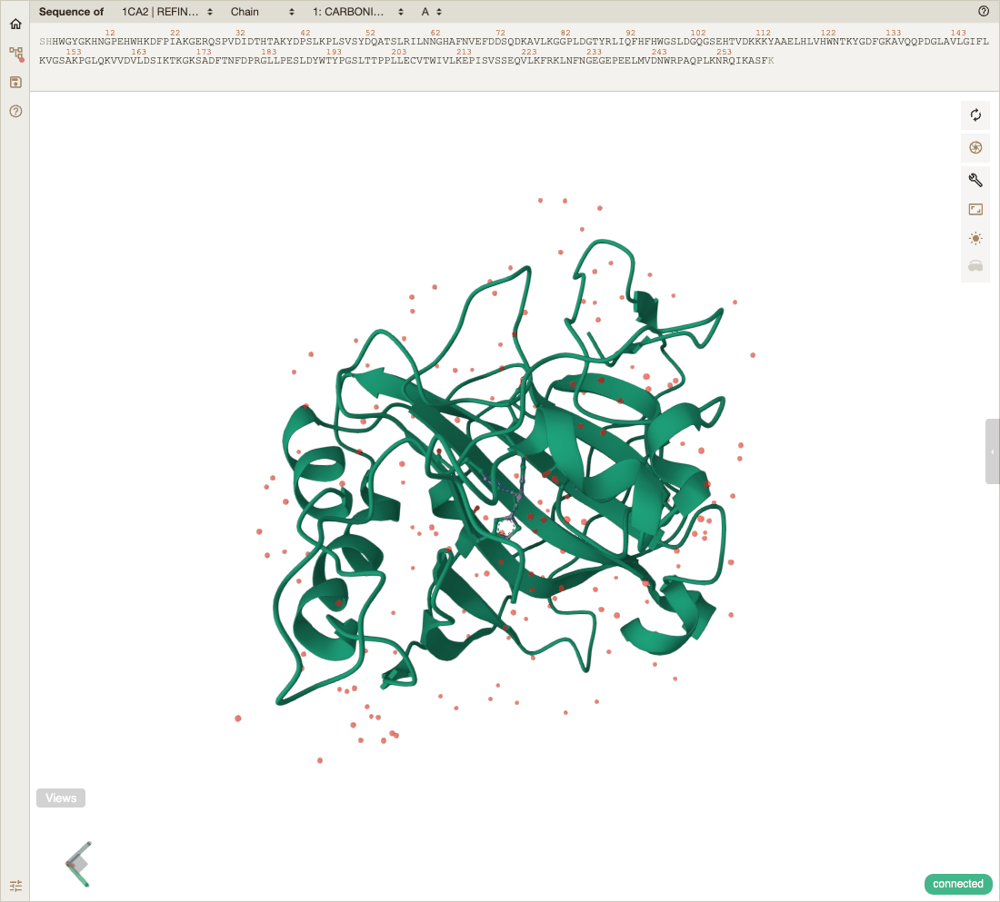
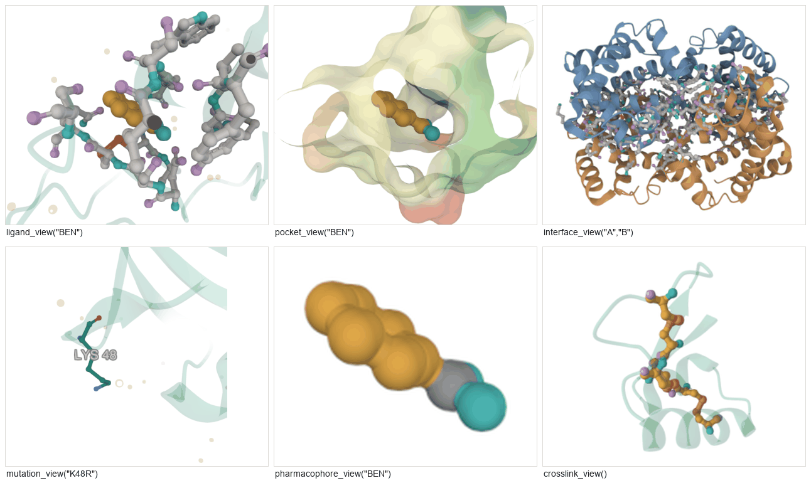
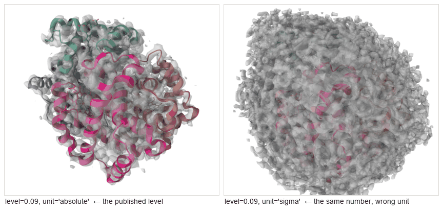

# protean

Agent-native molecular visualization. An MCP server (Python) drives a
[Mol\*](https://molstar.org) viewer in a browser tab — a model does the
driving, you watch and tweak.


*"Load 1CA2 and show me the catalytic zinc site" — protean's own output, and
its own answer: His94, His96 and His119 coordinating the zinc. The selection
was written as `byres (polymer within 5 of resn ZN) or resn ZN`; the figure
came out of `snapshot()` at a real physical size.*

protean is built for a model to use, not for a human at a REPL. Selections are
named handles that analysis returns and display tools consume; every reply is
structured data, read back off the viewer rather than echoed from the request;
and **an argument protean does not recognise is refused by name, with the list
of valid ones attached**, rather than quietly drawing nothing. That last one is
the house rule — there are 158 places in `server.py` alone where protean would
rather say no than hand back a confident picture of the wrong thing.

**Almost everything you see is Mol\*.** protean supplies a tool vocabulary and
an analysis half in Python; the rendering, the parsing, the camera and the path
tracer are Mol\*'s, and so is the credit — see *Built on Mol\** below.

> **Status: not released.** Version `0.1.0.dev0`, no tags, not on PyPI.
> Selections, analysis, publication rendering, trajectories, volumes and the
> one-call views all work end to end. Install from source — see below.

---

## Install

> **`uvx protean-mcp` does not work.** protean is not published to PyPI, and
> neither is its `wiggles-em` dependency, which resolves through a
> `[tool.uv.sources]` git pin that wheel metadata cannot carry. From source is
> the only path today.

Needs **Python 3.11+**, **Node 22**, [**uv**](https://docs.astral.sh/uv/), git,
and a browser.

```bash
git clone https://github.com/chemrich/protean
cd protean

uv sync                              # the Python side
npm install --prefix viewer          # the viewer's dependencies
npm run build --prefix viewer        # required: the viewer is a build artifact
```

Then point your assistant at it:

```bash
claude mcp add protean -- uv run --directory /absolute/path/to/protean protean-mcp
```

<details>
<summary>Claude Desktop</summary>

```json
{
  "mcpServers": {
    "protean": {
      "command": "uv",
      "args": ["run", "--directory", "/absolute/path/to/protean", "protean-mcp"]
    }
  }
}
```
</details>

The viewer build lands in `src/protean_mcp/static/` and is packaged into the
wheel. Without it the server starts and `open_viewer` reports that the app is
not built.

ffmpeg is optional and only needed for `movie()`; APBS is optional and only for
`electrostatics(method="apbs")`. `capabilities()` reports what the running
server can actually see.

**[Full install guide and first session →](docs/getting-started.md)**

---

## Your first three calls

> Open the viewer and load 1UBQ.

```python
open_viewer()
fetch_structure("1ubq")
```



*What opens. Mol\*'s icon rail on the left, the sequence strip on top, a
`connected` badge bottom-right, and a **Views** menu whose clicks come back to
the model on its next reply.*

The load reply ends with `[biological assembly, 660 atoms in both viewer and
analysis]`. That clause is the point of the project: the picture and the
numbers are the same molecule, and when they are not, the reply says so.

---

## Six questions, six calls

```python
ligand_view("BEN")            # a bound drug and what lines its pocket
pocket_view("BEN")            # the cavity, as a surface
pharmacophore_view("BEN")     # what each ligand atom can do
interface_view("A", "B")      # where two chains touch
mutation_view("K48R")         # the residues a mutation names — checked
crosslink_view()              # disulfides and metal sites
```



Each returns the residues it found, and each **refuses rather than mislead**:
`mutation_view` verifies the residue you named is the residue that is there,
because a mutation view highlighting the wrong residue because of a numbering
offset looks exactly like one that worked.

---

## One word, one look

```python
preset("textbook")
```


Twenty named recipes. A preset is a composition of the other display tools and
its reply lists every call it made, so nothing is reachable only through one.
**[The full gallery →](docs/gallery.md)** — every representation, colour theme,
lighting rig, shading style and material finish, shown rather than listed.

---

## What it can do

- **Selections** — PyMOL syntax for leaf predicates, composed through named
  handles: `select`, `combine`, `near`, `invert`.
  [Full reference →](docs/selections.md)
- **Analysis** — interfaces and buried area, solvent accessibility and burial
  depth, superposition with RMSD, conservation from an MMseqs2 alignment,
  electrostatics (screened Coulomb by default, APBS when available).
- **Rendering** — 24 representations, 51 colour themes, six lighting rigs,
  screen-space effects, PBR materials, path tracing, and `snapshot()` at a real
  physical size with the DPI written into the file.
- **Your own scalars as themes** — `define_field` turns any per-residue number
  you computed into a Mol\* theme, on both the colour and the width channel;
  `define_elements` recolours the periodic table.
- **Trajectories** — XTC/TRR/DCD/NetCDF, frame stepping, RMSF and RMSD series,
  turntables, keyframed camera moves, and ffmpeg encoding.
- **Volumes** — MRC/CCP4 (gzipped or not), DSN6, OpenDX, Gaussian cube and
  BinaryCIF maps, contoured as surface or mesh, with statistics read off the
  voxels rather than echoed from the header, **and the contour unit named
  rather than assumed**.



*Why the unit is a required argument. EMD-3488's published level is 0.09
**absolute**. The same number read as **sigma** is 0.0033 absolute — noise, and
nothing about the call looks wrong. There is no bare-number form of
`isosurface()` for exactly this reason.*

---

## Figures, not screenshots

`snapshot()` renders at whatever pixel count a physical size and DPI imply and
writes that resolution into the file. Mol\* cannot record physical resolution at
all, so a capture from any viewer is a picture at whatever size the window was.

protean also has a raster pipeline of its own, applied **in Python after the
capture** — the one place it does add to the rendering:


`spot-ink-plates` is the one that carries data: it binds *which plate a region
prints on* — a category, not a shade, so shading cannot quantise it away.

And `boil()` redraws the molecule every two frames with the atoms nudged, the
way hand-drawn animation breathes. How far an atom wanders follows how sure the
data is about it, so a disordered loop swings and an ordered core holds.


---

## Documentation

| Page | For |
|---|---|
| [Getting started](docs/getting-started.md) | install, first picture, the vocabulary |
| [Cookbook](docs/cookbook.md) | 14 worked recipes, each with its figure |
| [Gallery](docs/gallery.md) | every style value, shown |
| [Selections](docs/selections.md) | the complete selection language |
| [Tool reference](docs/tools.md) | every tool, generated from source |
| [Troubleshooting](docs/troubleshooting.md) | what a refusal means and what to do |
| [For PyMOL users](docs/for-pymol-users.md) | a translation table, and the honest gaps |

**Never used a molecular viewer?** Start with
[Getting started](docs/getting-started.md).
**Know PyMOL?** Start with [For PyMOL users](docs/for-pymol-users.md).

Everything else in [`docs/`](docs/README.md) is an engineering record — a plan
document per substantial piece of work, corrected in place afterwards. They are
kept because the wrong turns are the useful half, but they are not
documentation. [`docs/README.md`](docs/README.md) says which is which.

---

## Tools

`capabilities()` reports the live lists — representations, colour themes,
lighting rigs, shading styles, material finishes, gradients, presets,
path-trace quality, and whether ffmpeg is installed.

<!-- BEGIN GENERATED TOOL TABLE -->
| Area | Tools |
|---|---|
| Session | `open_viewer`, `fetch_structure`, `clear_viewer`, `save_session`, `load_session`, `capabilities` |
| Selections | `select`, `combine`, `near`, `invert`, `list_selections`, `remove` |
| Display | `show`, `hide`, `unhide`, `color`, `size`, `opacity`, `label`, `measure` |
| One-call views | `ligand_view`, `pocket_view`, `interface_view`, `mutation_view`, `crosslink_view`, `pharmacophore_view`, `conservation_view`, `electrostatic_view` |
| Custom themes | `define_field`, `define_elements` |
| Camera | `focus`, `orient`, `reset_view`, `lens`, `spin`, `keyframe`, `list_keyframes` |
| Analysis | `interface`, `superpose`, `conservation`, `electrostatics`, `sasa` |
| Scalar colouring | `color_by_potential`, `color_by_conservation`, `color_by_rmsf` |
| Style | `preset`, `background`, `lighting`, `effects`, `shading`, `material`, `path_trace` |
| Capture | `screenshot`, `snapshot`, `turntable`, `boil`, `record_trajectory`, `record_timeline`, `movie` |
| Trajectories | `load_trajectory`, `frame`, `rmsf`, `rmsd_series` |
| Volumes | `load_volume`, `isosurface`, `volume_info`, `list_volumes`, `remove_volume` |
<!-- END GENERATED TOOL TABLE -->

This table is generated by
[`docs/generate/tool_reference.py`](docs/generate/tool_reference.py) and a test
fails if it drifts. It used to be hand-maintained, and by the time it was
replaced it said "54 tools" above a list of 55 names while the source
registered 65 — three numbers, none of them right, and nothing in the repo
could notice.

---

## How it compares to PyMOL

[docs/benchmark.md](docs/benchmark.md) runs five common tasks through both, with
the real output of each. protean wins two, draws two, and **loses one**: PyMOL's
selection grammar has no gaps where protean's has several. A benchmark that only
showed wins would not be evidence.

[docs/for-pymol-users.md](docs/for-pymol-users.md) is the practical version — a
translation table and what does not translate.

---

## How it differs from Mol\*

protean is not a fork, a patch or a rival. It drives a stock Mol\* build. The
difference is who the controls are for.

**Mol\* is built for a person, or for a web developer embedding a viewer.** You
drive it with a mouse and its panels, or you write TypeScript against its
plugin API inside the browser. Both assume the thing in control is on the same
side of the screen as the picture.

**protean moves the controls to the other side.** The tool surface lives in a
Python process the model talks to over MCP, so "show me the zinc site" is a
call with named arguments and the reply is data it can use in the next call.
Four things follow, and they are most of what protean adds:

- **An analysis half that Mol\* does not have.** Interfaces and buried area,
  superposition with RMSD, conservation from a sequence alignment, RMSF over a
  trajectory, electrostatics. That work happens in Python with
  [biotite](https://www.biotite-python.org), and the results come back as
  numbers rather than as something drawn on screen.
- **One vocabulary over both halves.** A selection is a named handle that
  analysis returns and display tools consume, so the residues a calculation
  found are the residues you colour, without anyone re-deriving them.
- **The two halves must agree, and it is checked.** The atom count Python holds
  is reconciled against the viewer's, and a discrepancy is reported with its
  cause rather than passed over. A model answering confidently about a molecule
  other than the one on screen is the failure this project exists to prevent.
- **Figures instead of screenshots**, as above.

Everything *live* on screen — every representation, colour theme, lighting rig,
material, and the path tracer — is Mol\*'s, reached through a different set of
controls. The exceptions are the four print finishes and the boil's exposure
plate, which are protean's own and are composited in Python after the capture.

**What protean changes about the viewer.** It opens as a canvas rather than as
Mol\*'s full control layout: the left panel is collapsed to Mol\*'s own icon
rail, the right panel sits behind a tab, and the sequence strip stays because it
reports rather than acts. Two things *are* removed — the log, and five viewport
buttons (expand, settings, selection mode, animation, trajectory transport) —
each because it duplicates something protean drives through a tool. The
trajectory transport is the sharp case: it steps frames without telling the
analysis, which then reports on the frame it thinks is current. The state tree
is still there behind the tab, which is exactly where you want it when a picture
looks wrong.

---

## Known gaps

[docs/backlog.md](docs/backlog.md) lists what the benchmark and a 499-probe
corpus of structures and failure modes turned up, what has been fixed since, and
what is still open. Items still open are marked **open** there. It is kept as a
record rather than a tidy list: the diagnosis that looked obvious has been wrong
often enough to be worth writing down beside the fix.

One worth knowing before you rely on it: **`snapshot(crop=True)` is a no-op.**
It reports `cropped: true` and returns the frame unchanged. Frame with `focus()`
instead.

---

## Development

[CONTRIBUTING.md](CONTRIBUTING.md) has what CI enforces, every test gate, and the
habits that keep this codebase honest; [SECURITY.md](SECURITY.md) has the trust
model and how to report a vulnerability. The short version:

```bash
uv sync
uv run pytest                      # fast: no browser
npm test --prefix viewer           # viewer unit tests
```

The browser suite is opt-in, because it drives a real Chrome and fetches from
RCSB:

```bash
npm run build --prefix viewer      # the suite serves the built app
PROTEAN_DIFFERENTIAL=1 uv run pytest tests/test_render_differential.py
```

To regenerate every figure in this README:

```bash
uv run python docs/figures/make_figures.py
```

### How this codebase is tested

The dominant failure mode here is code that reports success and draws nothing,
or draws the wrong thing confidently. Mol\* accepts bad input without complaint.
So:

- Rendering is verified by **reading pixels**, not return values or file sizes —
  byte size cannot tell a transparent background from a black one.
- Replies **read state back** off the canvas rather than echoing arguments.
- New guards are checked by **deliberately breaking them** and confirming the
  test fails. Several tests here exist because that exercise showed the first
  version passed against the bug it was written for.

---

## Built on Mol\*

**protean is a way of driving [Mol\*](https://molstar.org), and almost
everything a user actually sees is Mol\*'s work.** It renders the molecule,
parses mmCIF and BinaryCIF, builds cartoons and surfaces, computes secondary
structure, handles the camera, contours volumes, and provides the path tracer
behind `path_trace()`. Take Mol\* away and there is no viewer; take protean away
and Mol\* is still one of the best molecular graphics programs there is.

Mol\* is developed by the [Mol\* team](https://github.com/molstar/molstar) at
[PDBe](https://www.ebi.ac.uk/pdbe/) and [RCSB PDB](https://www.rcsb.org),
building on the earlier LiteMol and NGL Viewer projects. It is the viewer behind
the structure pages at both of the world's main structural databases, which is a
good part of why it is worth building on: it is maintained, scrutinised and used
at scale by people who are not us.

> Sehnal D, Bittrich S, Deshpande M, Svobodová R, Berka K, Bazgier V,
> Velankar S, Burley SK, Koča J, Rose AS. **Mol\* Viewer: modern web app for 3D
> visualization and analysis of large biomolecular structures.** *Nucleic Acids
> Research* 49(W1):W431–W437, 2021.
> [doi:10.1093/nar/gkab314](https://doi.org/10.1093/nar/gkab314)

If you use protean for published work, cite Mol\*. It is
[MIT licensed](https://github.com/molstar/molstar/blob/master/LICENSE), and the
protean wheel redistributes the built viewer, so it carries Mol\*'s licence
notice with it as `molstar-LICENSE.txt` — a packaging test fails if that file
ever goes missing, and checks it is Mol\*'s notice rather than merely some MIT
text.

## Also built on

- [biotite](https://www.biotite-python.org) — structure and trajectory parsing,
  superposition ([paper](https://doi.org/10.1186/s12859-018-2367-z), BSD-3)
- [FastMCP](https://github.com/jlowin/fastmcp) — the MCP server (Apache-2.0)
- [Pillow](https://python-pillow.org) — TIFF/JPEG output and DPI metadata
- [pdb2pqr](https://www.poissonboltzmann.org) and
  [APBS](https://www.poissonboltzmann.org) — optional electrostatics
  ([paper](https://doi.org/10.1002/pro.3280))
- [ColabFold](https://github.com/sokrypton/ColabFold) — the MMseqs2 API behind
  `conservation()`
- [ffmpeg](https://ffmpeg.org) — optional, for `movie()`

## Licence

MIT. See [LICENSE](LICENSE).
