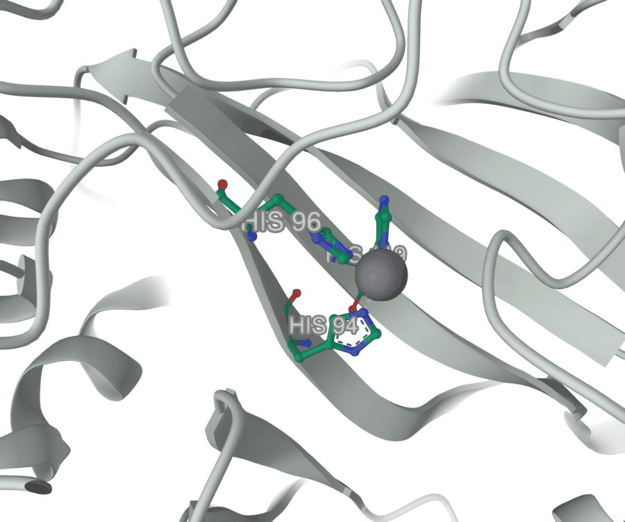
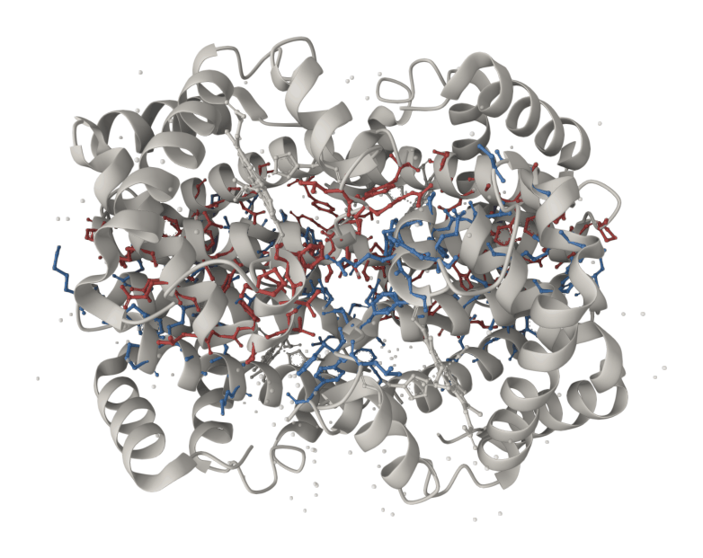
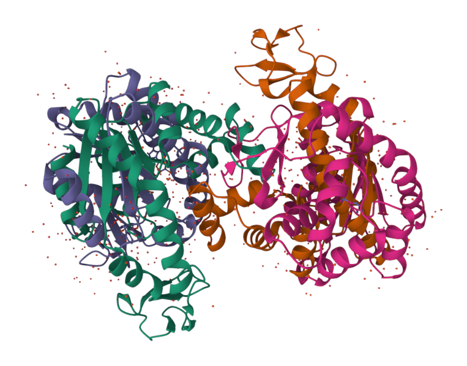
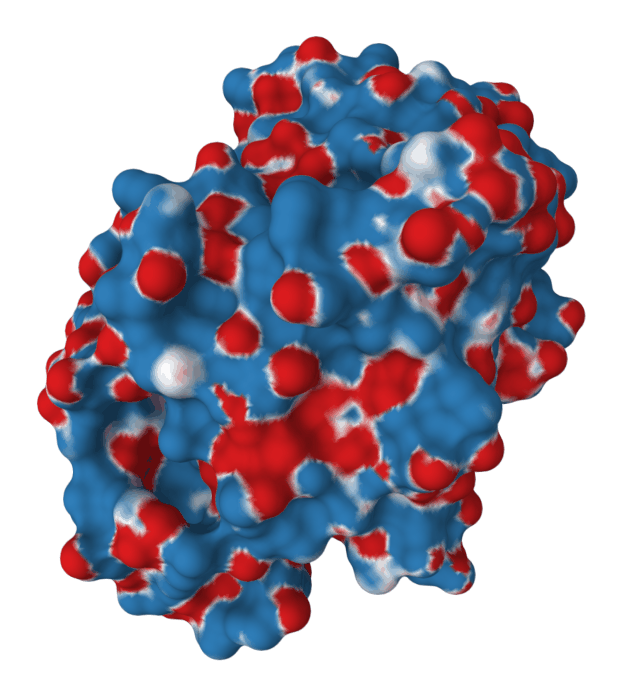
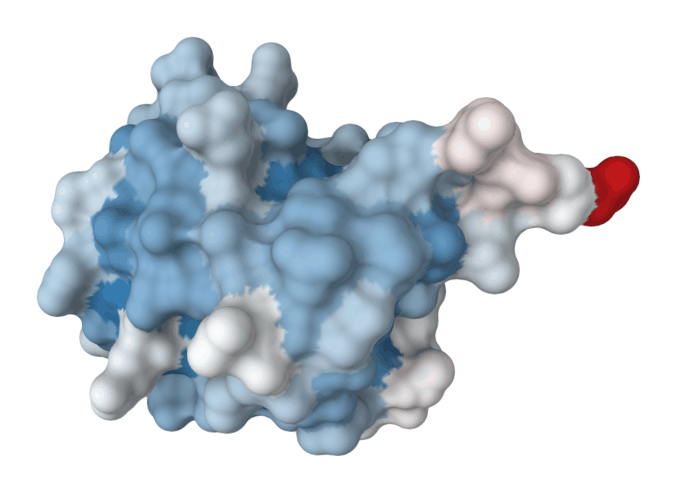
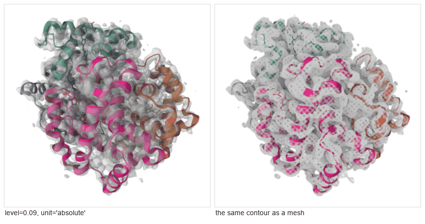

# Cookbook

Recipes for the things people actually ask for. Each one is a real sequence of
calls with a real result.

You will not normally type these. You say the sentence at the top of each
recipe and your model makes the calls — the calls are here so you can see what
it did, and ask it to change one step.

**Every recipe states what it needs.** Anything marked ⚠ wants more than a
browser and a network connection.

---

## Contents

**Looking at one structure**
[1. Load it and see it](#1-load-it-and-see-it) ·
[2. Find the active site](#2-find-the-active-site) ·
[3. Show a bound drug](#3-show-a-bound-drug) ·
[4. Label a distance](#4-label-a-distance)

**Comparing and analysing**
[5. What holds this dimer together](#5-what-holds-this-dimer-together) ·
[6. Superpose two structures](#6-superpose-two-structures) ·
[7. Charge on the surface](#7-charge-on-the-surface) ·
[8. What is buried](#8-what-is-buried)

**Predicted models and maps**
[9. How much of this prediction to trust](#9-how-much-of-this-prediction-to-trust) ·
[10. Put a model in its density](#10-put-a-model-in-its-density)

**Getting it out**
[11. A journal figure](#11-a-journal-figure) ·
[12. A turntable movie](#12-a-turntable-movie) ·
[13. A print](#13-a-print) ·
[14. Hand the scene to someone else](#14-hand-the-scene-to-someone-else)

---

## 1. Load it and see it

> Open the viewer and load ubiquitin.

```python
open_viewer()
fetch_structure("1ubq")
```


The red dots are ordered water from the crystal. To be rid of them, take the
scene over rather than drawing on top of it:

```python
hide("auto")                                   # `auto` is what the load drew
show(selection="polymer", name="fold", representation="cartoon")
```

**`hide("auto")` is the idiom to learn.** Drawing a second representation over
the load's own leaves two coincident pictures, which read as one muddy one.
Every preset that decides what is drawn does this first.

---

## 2. Find the active site

> Show me the catalytic zinc site of carbonic anhydrase.

```python
fetch_structure("1ca2")
preset("publication-cartoon")
select("byres (polymer within 2.6 of metals)", name="site")
show(handle="site", representation="ball-and-stick", color="element-symbol")
focus("site")
```

The selection returns before anything is drawn:

```
{"atom_count": 30, "residue_count": 3, "chains": ["A"],
 "residues": [{"chain": "A", "seq": 94,  "comp": "HIS"},
              {"chain": "A", "seq": 96,  "comp": "HIS"},
              {"chain": "A", "seq": 119, "comp": "HIS"}]}
```

His94, His96, His119 — the answer as data *and* as a picture of the thing the
data describes. `metals` is protean's own keyword; PyMOL makes you name the
element.

Widen the shell to see the second layer too:

```python
select("byres (polymer within 5 of resn ZN) or resn ZN", name="pocket")   # 46 atoms
```

---

## 3. Show a bound drug

> Show the inhibitor in trypsin and what lines its pocket.

```python
fetch_structure("3ptb")
ligand_view("BEN")          # the ligand and the residues around it
pocket_view("BEN")          # the cavity it sits in, as a surface
pharmacophore_view("BEN")   # what each of its atoms can do
```


These are the **one-call views** — recipes over the same primitives everything
else uses, and each returns the residues it found.

| View | Does |
|---|---|
| `ligand_view(resn, around=5.0)` | draws the ligand and the residues lining its site |
| `pocket_view(resn, around=5.0)` | the cavity as a surface, ligand inside it |
| `pharmacophore_view(resn)` | colours the **ligand's** atoms by donor / acceptor / hydrophobe |
| `interface_view(chain_a, chain_b)` | two chains apart, with the contacts picked out |
| `mutation_view("K48R", chain="A")` | the residues a mutation string names |
| `crosslink_view(distance=2.5)` | disulfides and metal coordination |

**`pharmacophore_view` types atoms by inference, not measurement.** Most crystal
structures carry no hydrogens, so donor and acceptor follow from element and
heavy-atom connectivity — the rules a chemist applies by eye, and wrong in the
same places. The reply says which rules fired; argue with those rather than
with the picture, which looks equally confident either way.

**`mutation_view` verifies the residue is what you said it was**, and refuses
when it is not. An offset of one is the most common thing that goes wrong with
residue numbering and the least visible — a mutation view highlighting the
wrong residue looks exactly like one that worked.

**`crosslink_view` refuses** on a structure with neither a disulfide nor a
metal, rather than drawing a bare cartoon and calling it a crosslink view.

---

## 4. Label a distance

> Label the zinc ligands and measure the closest contact.

```python
select("resn ZN", name="zinc")
select("byres (polymer within 2.6 of resn ZN)", name="site")
show(handle="site", representation="ball-and-stick", color="element-symbol")
show(handle="zinc", representation="spacefill", color="#7d7d8a", size=0.55)
label(name="site", level="residue")

select("chain A and resi 94 and name NE2", name="ne2")
measure(kind="distance", names=["ne2", "zinc"])
```



`measure` takes `"distance"` (2 selections), `"angle"` (3) or `"dihedral"` (4).
**Each selection is measured at its centroid**, so point-like selections read
most clearly — name a single atom, as `ne2` does above, rather than a whole
residue.

`size=0.55` on the zinc shrinks its van der Waals sphere so it does not hide
what it coordinates.

---

## 5. What holds this dimer together

> Colour haemoglobin's α–β interface and list the contacts.

```python
fetch_structure("1hho")
preset("publication-cartoon")
result = interface("A", "B")
show(handle=result["handles"]["a"], representation="ball-and-stick", color="#c0504d")
show(handle=result["handles"]["b"], representation="ball-and-stick", color="#4f81bd")
```



`interface()` returns buried area per side, every interface residue with how
much of it is buried, every contact with its distance and kind, **the criterion
it used**, and handles for both sides.

**Two things to know before quoting the number.**

*It reports the assembly, not the deposited file.* Loaded as a biological
assembly, 1HHO is the α₂β₂ tetramer, and `interface("A","B")` reports the total
A–B interface across it. Pass `copy=0` for the single αβ dimer a crystal
structure deposits — that is the question PyMOL's `get_area` answers.

*The criterion is stated because it has to be.* Heavy-atom N/O within 3.5 Å.
There are no hydrogens in most crystal structures, so hydrogen-bond angles
cannot be checked, and the reply says so rather than calling a contact a bond.

[benchmark.md](benchmark.md) works this exact comparison through PyMOL too,
including the naive PyMOL script that returns a confidently wrong 0.3 Ų.

---

## 6. Superpose two structures

> Superpose the open and closed forms of adenylate kinase.

```python
fetch_structure("1ake")
fetch_structure("4ake", name="4ake")
superpose("1ake", "4ake")
```



Returns the RMSD, how many residues actually aligned, and the sequence
identity. `mode` is the whole question:

- **`"sequence"`** (default) aligns the two sequences and superposes the
  residues that align. Right whenever the two are the same protein.
- **`"structural"`** ignores sequence and matches residues by the shape of the
  local backbone — for proteins too diverged for a sequence alignment to mean
  anything. Slower, more permissive, and it maximises how much it superposes,
  so expect more residues at a worse RMSD.

**Name a chain.** Superposing two multi-chain structures asks one rigid
transform to satisfy every chain at once, which none can do once the chains
have moved relative to each other. The honest answer is then a large RMSD —
`mobile_chain="A", target_chain="A"` asks the question you meant.

**A known gap:** PyMOL's `cealign` finds a rigid core protean's sequence-based
`superpose` cannot. On this exact pair, `cealign` reports 3.46 Å over 112
residues where protean reports 17.7 Å over 414. Both are correct answers to
different questions, and [benchmark.md](benchmark.md) calls this a loss.

---

## 7. Charge on the surface

> Show me trypsin's surface charge.

```python
fetch_structure("3ptb")
hide("auto")
show(selection="polymer", name="surf", representation="molecular-surface")
electrostatics()
color_by_potential(handle="surf", domain=[-5, 5])
```



Red is acidic, blue basic, white neutral — the convention. `domain=[-5, 5]` in
kT/e is a common choice for a figure; leave it out and protean picks a
symmetric range about zero, which keeps neutral white.

**`method` is reported, never assumed.** `"auto"` uses APBS if a runnable
binary is present and falls back to a screened Coulomb field otherwise. The two
are not equivalent, and a potential whose provenance is unstated is worth
nothing — so the reply always names which one ran. ⚠ APBS is optional; without
it you get the Coulomb approximation and are told so.

To get the numbers without rendering anything:

```python
electrostatics(handle="site")     # per-residue potential over that set
```

---

## 8. What is buried

> Which residues are exposed, and which are buried? Colour the surface by it.

```python
hide("auto")
show(selection="polymer", name="fold", representation="molecular-surface")

burial = sasa()
define_field("burial", values=burial["residues"], key="relative",
             palette="blue-white-red")
color("burial", name="fold")
```



`sasa()` gives three numbers per residue from one Shrake-Rupley pass:
`area_a2`, `relative`, and `depth_a` — how far a buried residue sits from the
surface, which accessibility alone cannot tell you.

**`relative` is the one to draw.** Raw area is misleading across residue types:
a tryptophan showing 60 Ų is buried and a glycine showing 60 Ų is wide open,
because they start with very different amounts of surface. Divided by the
maximum, the number means the same thing everywhere. It can exceed 1 — a
terminal residue has surface the reference tripeptide does not, and on 1UBQ the
C-terminal glycine comes out at 1.42.

### Any number you have can become a theme

That is what `define_field` is for, and it is not limited to `sasa`. Hand it
per-residue values from anywhere — your own calculation, a spreadsheet, another
tool — and it registers a real Mol\* theme you can pass to `color()`. Pass
`sizes` and it drives the **width** channel too, so a tube can get fatter where
your number is larger.

The viewer counts how many residues the field actually reached, so a field that
matches nothing cannot register as a success. Note that `load_session` does
**not** restore these — re-register a custom field after loading a session.

`define_elements` does the same job for the periodic table, when the standard
element colours are not the ones you want.

---

## 9. How much of this prediction to trust

> Load the AlphaFold model for haemoglobin alpha and show me its confidence.

```python
fetch_structure("P69905")       # a UniProt accession fetches AlphaFold
preset("plddt")
```


**pLDDT is a confidence score, not a B-factor**, even though it lives in the
same column. High pLDDT means the prediction is *more* confident; a high
B-factor means an experiment is *less* certain. They run in opposite
directions.

protean tracks which column was loaded and **refuses** to colour by the wrong
one. `color("uncertainty")` on a predicted model is an error, not a plausible
picture with its ramp reversed.

`preset("scaffold")` goes further: it draws the confident regions and covers
the guessed ones with an opaque surface, so a low-confidence loop cannot be
mistaken for a structure. It refuses on an experimental structure, where there
is nothing to cover.

---

## 10. Put a model in its density

> Show me haemoglobin's cryo-EM map with the model fitted in it.

⚠ Needs a map file on disk. This one is 1.3 MB from EMDB.

```python
fetch_structure("5me2")
preset("publication-cartoon")
load_volume("emd_3488.map.gz", name="hb", provenance="measured")
isosurface(name="hb", level=0.09, unit="absolute", opacity=0.45)
isosurface(name="hb", level=0.09, unit="absolute", style="mesh")
```



**`unit` is not a detail, and there is no bare-number form of this call.** EMDB
publishes author-recommended contour levels as *absolute* map values, while
most viewers contour in *sigma*. EMD-3488's published level is 0.09 absolute.
Typed in as sigma it would contour noise and look like an ordinary bad map
rather than a unit error.

`load_volume` reports statistics **computed by walking the voxels**, not echoed
from the file header — alongside the header's own numbers, labelled `stated`. A
large disagreement between the two is information: it says the file has been
cropped or rescaled and nobody updated the header.

`provenance` is **never inferred**. A filename saying `deepemhancer` is not
evidence. An undeclared map stays `unknown`, and the reply carries a caveat
line to show beside any picture of it.

Formats: MRC/CCP4 (gzipped or not), DSN6, OpenDX, Gaussian cube, BinaryCIF.

---

## 11. A journal figure

> Give me that as a double-column figure at 600 dpi.

```python
snapshot(path="figure.tiff", column="double", dpi=600, format="tiff")
```

`column="single"` is 89 mm and `"double"` is 183 mm — Nature's widths, and
close enough to most journals. Pass `width_mm` for anything else. **The pixel
count follows from the width and the DPI**, so you never compute it, and the
resolution is written into the file so it survives into a document.

| Argument | Use |
|---|---|
| `format` | `png`, `tiff` or `jpeg`. PNG and TIFF are lossless and keep transparency |
| `transparent` | drop the background for this one capture |
| `finish` | redraw as a print — see [the gallery](gallery.md#print-finishes) |
| `overwrite` | required to replace an existing file |

JPEG has no alpha channel, so `transparent=True` with `format="jpeg"` is
refused rather than silently flattened.

> ⚠ **`crop=True` does not currently work.** It reports `cropped: true` and
> returns the frame unchanged. Frame your shot with `focus()` instead, or trim
> the result yourself — which is what `docs/figures/make_figures.py` does.

---

## 12. A turntable movie

> Spin it and render a movie.

⚠ `movie()` needs ffmpeg. `capabilities()` reports whether it was found.

```python
turntable(directory="frames/", frames=120, width=1200)
movie(directory="frames/", path="spin.mp4", fps=30)
```

For a camera move rather than a spin, save positions and interpolate between
them:

```python
focus("site");  keyframe("close")
reset_view();   keyframe("wide")
list_keyframes()
record_timeline(directory="frames/", frames=60, easing="ease-in-out")
```

For a trajectory, ⚠ needs an XTC/TRR/DCD/NetCDF file:

```python
load_trajectory("run.xtc", stride=10, max_frames=100)
rmsf()                       # which parts move
color_by_rmsf()              # draw that
rmsd_series(reference=0)     # how far each frame drifted
record_trajectory(directory="frames/")
```

`load_trajectory` **refuses a trajectory whose atom count does not match** the
loaded structure, rather than laying the wrong coordinates onto it.

---

## 13. A print

> Make it look like an engraving.

```python
snapshot(path="plate.png", finish="cross-hatch")
snapshot(path="plates.png", finish="spot-ink-plates")
```


The finish is applied **after the capture, in Python** — the viewer does not
show it, and the reply says so outright, because protean's claim is that the
picture and the analysis describe the same thing and a second renderer having
touched it afterwards is exactly the sort of thing that claim depends on
knowing.

`spot-ink-plates` reads the colours already in the render, so colour by element
first and the plates come out as elements. See
[the gallery](gallery.md#print-finishes).

---

## 14. Hand the scene to someone else

```python
save_session("scene.protean")
load_session("scene.protean")
```

One file holding the scene *and* the structure, which reopens as it was.

**A session file is untrusted input.** protean checks what it is about to
restore rather than replaying it blindly — see [SECURITY.md](../SECURITY.md)
and [session-state.md](session-state.md). The risk in a session file is not
reading it; it is what the deserialised state can be made to do.

---

## See also

- [Getting started](getting-started.md) — install and first steps
- [Selections](selections.md) — the full selection language
- [The gallery](gallery.md) — every representation, theme, preset and finish
- [Tool reference](tools.md) — every tool, generated from the source
- [Troubleshooting](troubleshooting.md) — when a call refuses
