# Gallery

What protean makes. Each entry is a question you could ask, the tool that
answers it, and the picture that comes back — with the reply printed beside it,
pasted from the run that produced the figure.

The building blocks these are made of — every representation, colour theme,
lighting rig, shading style, material and background — are in the
**[style reference](style-reference.md)**.

Every figure here is regenerated by
[`docs/figures/make_figures.py`](figures/make_figures.py), from the tool calls
printed beside it.

---

## One-call views — a question, answered as a picture

Eight tools that each answer one question and set up their own scene to do it:
colouring, transparency, labels and framing, from a single call. Every one of
them **refuses rather than mislead** — a view of a ligand that is not there, or
of a mutation the structure does not carry, would draw an empty selection and
report success, so instead it says what it found and what it did not.

Every number printed below is from the run that produced the picture beside it.

---

### `ligand_view` — a bound drug, and what holds it

The ligand in element colours, every residue with an atom within 5 Å of it as
sticks, and the rest of the protein dropped to a pale cartoon so the site is the
only thing in focus.

> Show me the inhibitor in trypsin and what lines its pocket.

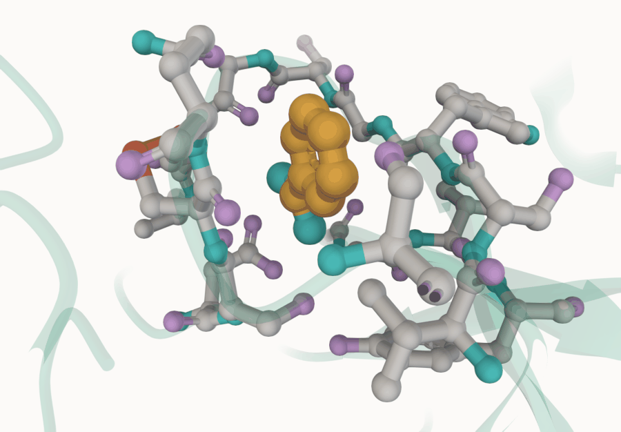

*`3PTB`. Benzamidine is a fragment, not a drug — nine heavy atoms — and that is
why it suits this view: you can see the whole thing at once, sitting on the
aspartate at the bottom of the pocket that makes trypsin cut after arginine and
lysine.*

```
{"view": "ligand", "ligand": "BEN", "copies": 1, "atoms": 9,
 "lining_residues": 17, "handles": ["ligand_ben", "ligand_ben_pocket"]}
```

The handles are the point. `ligand_ben_pocket` is those seventeen residues as a
set you can hand to anything else — restyle them, measure them, intersect them
with an interface — without re-deriving which ones they were.

**Where it will mislead you.** A crystal structure usually carries no hydrogens,
so "what lines the pocket" is a distance answer rather than a chemical one. A
residue 5 Å away pointing its backbone at the ligand is in that count of 17; one
at 5.2 Å making a water-mediated hydrogen bond is not.

---

### `pocket_view` — what shape is the cavity?

The same lining residues drawn as a half-transparent surface instead of sticks,
which is what a pocket looks like when the question is about shape rather than
about which residues touch what.

> What shape is the pocket benzamidine sits in?

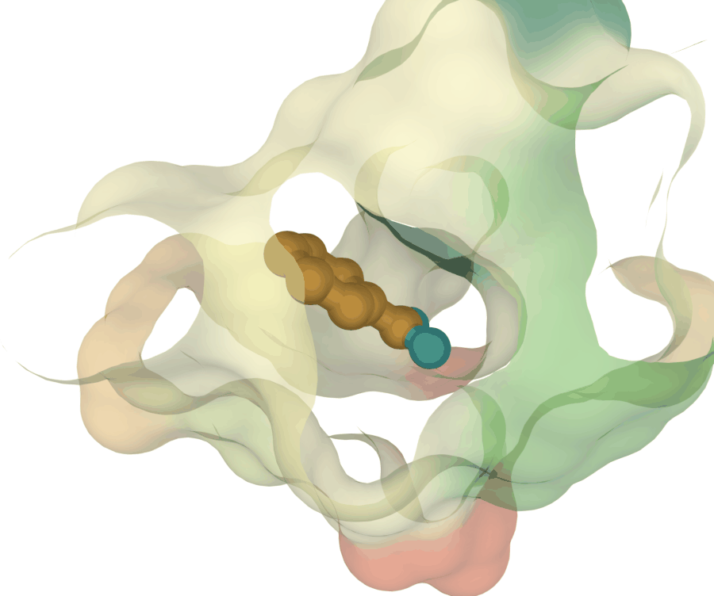

*`3PTB` again, deliberately. Two views of one site is the honest way to show
what changes: the atoms are identical to `ligand_view` above and only the
drawing differs.*

```
{"view": "pocket", "ligand": "BEN", "lining_residues": 17,
 "handles": ["pocket_ben", "pocket_ben_ligand"]}
```

**This is not cavity detection.** It shows the pocket around a ligand you name.
It cannot find pockets in an empty structure — that is a different and much
harder problem needing an algorithm protean does not have.

---

### `interface_view` — where do these two chains touch, and how much?

Each chain as a cartoon in its own colour — blue and warm orange — with every
residue within reach of the partner drawn over it as element-coloured sticks,
and a number for how much area the contact buries.

> Where do haemoglobin's alpha and beta chains touch?

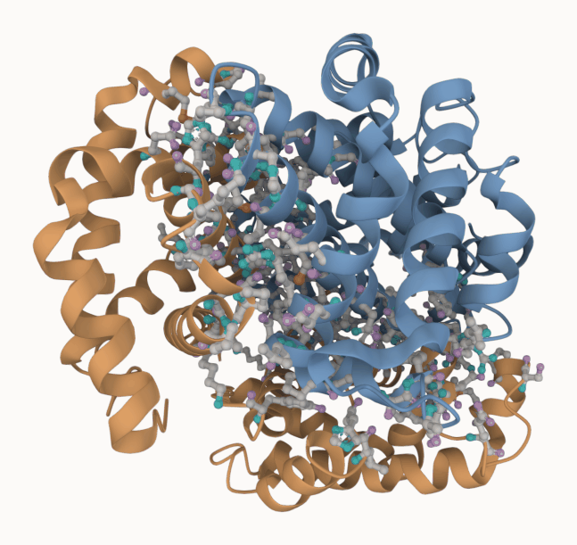

*`1HHO`, human oxyhaemoglobin. The alpha-beta pair is the interface the whole
molecule is built on — it is what moves when haemoglobin changes state.*

```
{"view": "interface", "chains": ["A", "B"],
 "contact_residues": {"iface_a": 70, "iface_b": 70},
 "buried_area": 5530.2,
 "handles": ["chain_A", "chain_B", "iface_a", "iface_b"]}
```

`buried_area` is in square ångströms and is the number to read first. Seventy
residues a side sounds like a lot until you know whether they are pressed
together or merely adjacent.

---

### `mutation_view` — is the residue this notation names the residue that is there?

The named positions as sticks with residue labels, everything else faded, framed
on what was asked for.

> Show me the sickle-cell mutation on haemoglobin's beta chain, with two more
> positions for context.

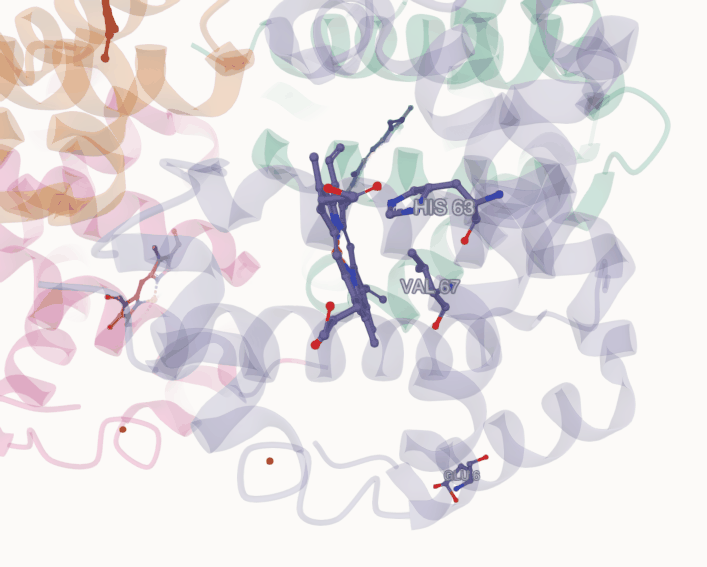

*`4HHB`. E6V is the best-known point mutation in biology; the haem sits in
frame because His63 is the distal histidine that coordinates its iron.*

```
{"view": "mutation",
 "verified": [{"mutation": "E6V", "residue": "GLU", "seq": 6},
              {"mutation": "H63Y", "residue": "HIS", "seq": 63},
              {"mutation": "V67F", "residue": "VAL", "seq": 67}],
 "handle": "mutations"}
```

**`verified` is the whole point of this tool.** It checks that the residue the
notation names is the residue the file holds, and refuses the entire request if
any one disagrees:

> The structure does not match the notation, so this would have highlighted the
> wrong residues: K16E: position 16 holds GLY, not LYS. Numbering offset by a
> construct tag is the usual cause; pass `chain=` if the structure has more than
> one.

That refusal is real — it is what this figure got when it was first drawn with a
mutation list borrowed from elsewhere. A mutation view highlighting the wrong
residue because of a numbering offset looks exactly like one that worked.

---

### `pharmacophore_view` — what can each atom of this ligand actually do?

The ligand alone, every atom coloured by what it can do chemically: donate a
hydrogen bond, accept one, do both, or contribute nothing but bulk.

> What can each atom of the HIV protease inhibitor do?

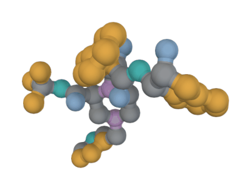

*`1HSG`, indinavir. A ligand with enough atoms to do several different things —
which is the point of the view, and why a nine-atom fragment is the wrong
subject for it.*

```
{"view": "pharmacophore", "ligand": "MK1",
 "features": {"hydrophobe": 22, "both": 4, "donor": 3, "acceptor": 2},
 "atoms_the_viewer_matched": 31,
 "grey_means": "no feature here, not unknown (#9aa0a6)"}
```

The reply carries its own epistemics, and they matter here more than in any
other view:

> Donor and acceptor come from element and heavy-atom connectivity, not from
> hydrogens, which this structure most likely does not carry. Rules of thumb,
> reported so they can be argued with.

Note `grey_means`. Grey is a positive statement — *no feature here* — not a
shrug, and the difference decides whether an uncoloured atom is evidence.

---

### `crosslink_view` — what is holding this fold together?

Disulfide bridges and metal coordination sites as element-coloured sticks
against the rest of the structure faded to a quarter. Two distance filters over
what protean already knows, not new machinery.

> What holds crambin's fold together?

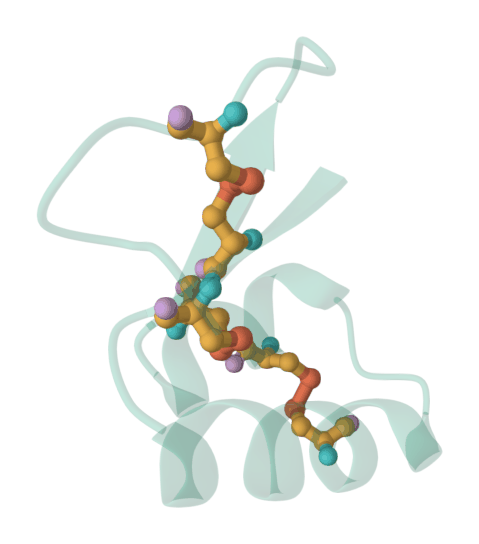

*`1CRN`, crambin — 46 residues and three disulfides, which is an unusual density
of crosslinks and the reason it folds as tightly as it does.*

```
{"view": "crosslink",
 "disulfides": [{"a": "A 3",  "b": "A 40", "angstroms": 2.0},
                {"a": "A 4",  "b": "A 32", "angstroms": 2.03},
                {"a": "A 16", "b": "A 26", "angstroms": 2.05}],
 "metal_atoms": 0, "coordinating_residues": 0, "handles": ["disulfides"]}
```

Those three lengths — 2.00, 2.03 and 2.05 Å — are what a real disulfide measures,
which is the quickest check that the search found bonds rather than coincidences.

**It refuses a structure with neither a disulfide nor a metal**, rather than
drawing a bare cartoon and calling it a crosslink view. That picture would be
indistinguishable from one where the search failed.

---

### `conservation_view` — which parts has evolution refused to change?

The chain scored against an alignment of its homologs and coloured by how
constrained each position is. Blue is conserved, red is variable.

> Which parts of trypsin has evolution held onto?

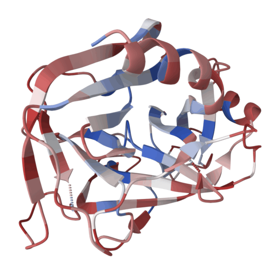

*`3PTB`. Trypsin has the story this ramp is good at — an invariant catalytic
core inside variable surface loops. Choose the subject carefully: see the trap
below.*

```
{"view": "conservation", "chain": "A", "mode": "gradient", "msa_depth": 18023,
 "scored": {"entropy_min": 0.021, "entropy_max": 0.954, "source": "cache"}}
```

**Read `msa_depth` before you read the picture.** A protein with few known
homologs comes out conserved everywhere, because nothing was found to disagree
with it — and that picture is indistinguishable from a genuinely invariant
protein. Below ten aligned sequences the reply carries a warning saying so.

**And the default scaling will lie to you about a famous protein.** `scale`
defaults to `"relative"`, which stretches the ramp across whatever entropy range
this protein happens to have, so the full blue-to-red spread gets used no matter
how conserved it actually is. Rendered on ubiquitin — one of the most conserved
proteins in biology — that produces a mostly *red* picture. Use
`scale="absolute"` when the question is how conserved, rather than which parts.

---

### `electrostatic_view` — where is the charge on this surface?

The potential solved on a grid, a molecular surface put up to carry it, and the
surface painted: red acidic, blue basic, white neutral.

> Where is the charge on ubiquitin's surface?

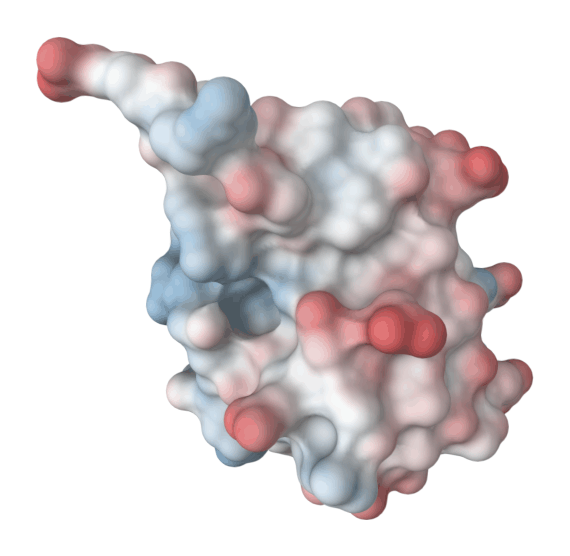

*`1UBQ`. The surface is the point — a potential map with nothing to display it
on answers no question you can look at.*

```
{"view": "electrostatic", "atoms": 602, "residues": 76,
 "method": "screened Coulomb (uniform dielectric 78.54, ionic strength 0.15 M)
            — not a Poisson-Boltzmann solution; magnitudes are indicative only",
 "apbs_available": true, "handles": ["potential_surface"]}
```

**`method` is not decoration.** protean uses APBS when a runnable binary is
present and a screened Coulomb field otherwise, and the two are not equivalent —
a potential whose provenance is unstated is worth nothing. When the
approximation runs, the reply says what it costs you:

> Uniform dielectric: no protein interior, no reaction field. The shape of the
> surface potential is reliable, the magnitude is not, and no free energy
> follows from it.

Measured against APBS on this same molecule, the approximation tracks surface
potential closely in shape — r = 0.96, 94% sign agreement — while running about
1.6× low in magnitude. Read it for *where* the charge is, never for an energy.

---

## Presets — a whole look in one call

```python
preset("publication-cartoon")
```

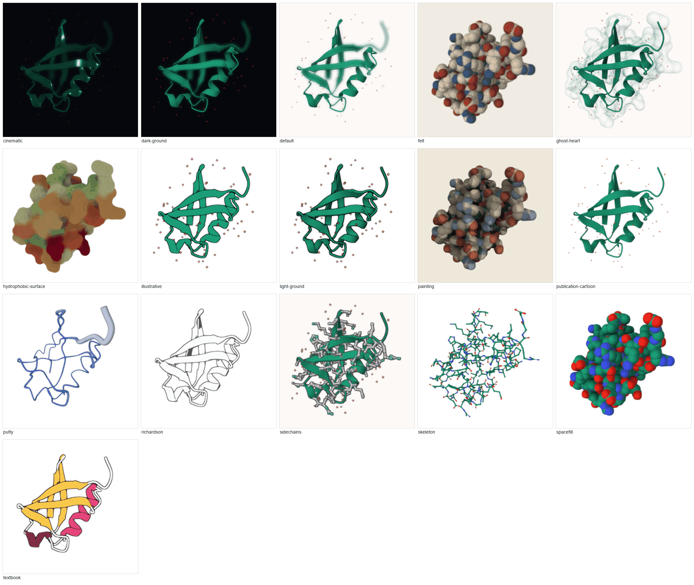

A preset is a composition of the other display tools, and the reply lists every
call it made — so nothing here is reachable *only* through a preset, and you
can adjust any step afterwards.

**They come in two kinds, and it matters when you combine them.**

*Restyle only* — ground, lighting, shading, material. What is drawn is left
alone, so these stack onto whatever you have:

`publication-cartoon` · `illustrative` · `light-ground` · `dark-ground`

*Decide what is drawn* — these **replace** the picture rather than adding to
it, so applying a second one switches views instead of piling up:

`default` · `textbook` · `putty` · `plddt` · `spacefill` · `skeleton` ·
`sidechains` · `hide-sidechains` · `active-site` · `hydrophobic-surface` ·
`ghost-heart` · `richardson` · `painting` · `felt` · `scaffold`

`default` is the way back. It restores what the load drew and leaves lighting
and ground alone.

### Four that refuse rather than mislead

Not shown above, because on ubiquitin each would have drawn something
dishonest — and each says so instead:

- **`plddt`** and **`scaffold`** need a *predicted* model. `scaffold` draws the
  confident regions and covers the guessed ones with an opaque surface; on an
  experimental structure there is nothing to cover, so it refuses.
- **`active-site`** needs a handle naming the site: *"active-site needs a handle
  saying which site — from select(), interface(), or near()."*
- **`hide-sidechains`** needs sidechains already drawn: *"No sidechains are
  drawn, so there are none to hide. Apply the sidechains view first."*

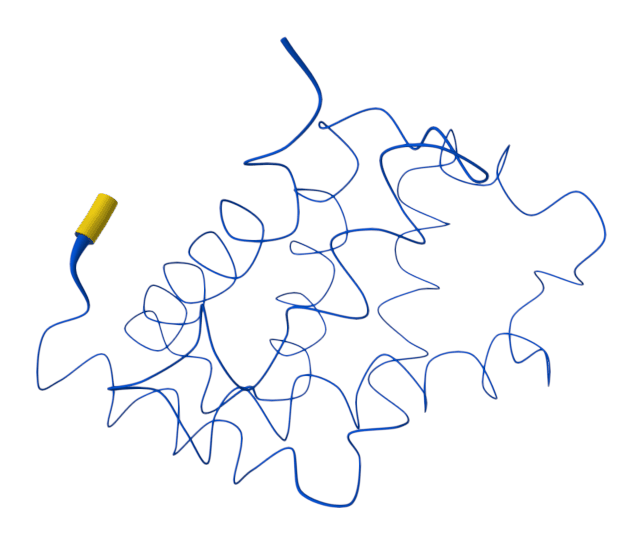

*`preset("plddt")` on AlphaFold model `P69905`. The tube is fat and orange
where the prediction is least confident, thin and blue where it is most.*

---

## Print finishes

These are not renderer settings. `snapshot(finish=...)` redraws the captured
frame **in Python, after the render**, so what you get is not what the viewer
is showing. The reply says so outright.

```python
snapshot(path="plate.png", finish="spot-ink-plates")
```

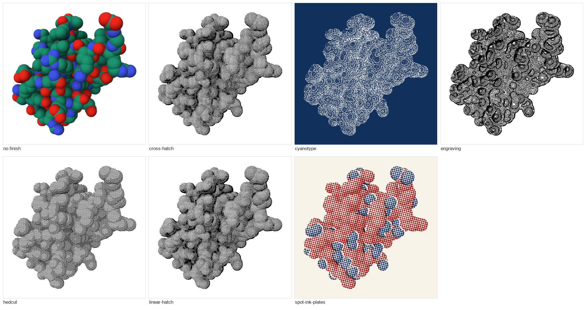

| Finish | What it is |
|---|---|
| `linear-hatch` | the hatching, in one direction: strokes that bend around a form rather than being ruled across it, swelling where one form passes in front of another. The bolder mark of the two |
| `cross-hatch` | the same hatching with a second family laid across the first, into lozenges that shear as they pass over a curve. Finer than the linear |
| `hedcut` | one angle, six bands, the stroke thickening with the tone and never turning with the form — the stipple-portrait look rather than a drawing of the surface |
| `engraving` | the survey's contours in black on white, at fourteen levels: it traces the recovered lighting like a relief map, so every atom becomes a contoured hill |
| `cyanotype` | a survey print in Prussian blue and paper white. Contours the shading rather than hatching it, so every atom becomes nested rings |
| `spot-ink-plates` | a two-colour press: the frame is sorted into colour families, each screened onto its own plate at its own angle, printed slightly out of register |

**`spot-ink-plates` is the one that carries data.** What it binds is *which
plate a region prints on* — a category, not a shade, so shading cannot quantise
it away. Colour by element and the plates are elements: carbon on one, oxygen
and nitrogen on the other, their crossing where the two disagree. Colour by
chain and they are chains. On a greyscale render there is nothing to sort and
everything prints on one plate.

---

## Boil — a molecule drawn on twos

```python
boil(directory="poses/", frames=24, trails=True)
```

Hand-drawn animation is never twice the same drawing: the line breathes frame
to frame, and that boil is most of what makes it read as *made*. Every other
molecular viewer treats the still frame as the unit and reserves motion for the
camera.

`boil()` moves the atoms themselves, a little, in a new random direction every
pose, and holds each pose for two frames.

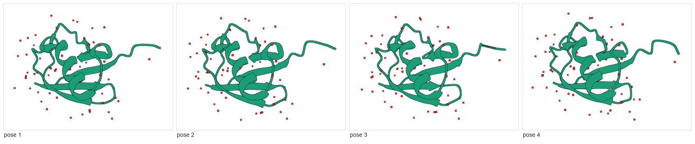

**The wander is not decoration — it follows how sure the data is about each
atom.** A disordered loop swings and an ordered core holds. On a predicted
model, the guessed regions swing and the confident ones hold. On a structure
whose column is flat, the reply says so rather than implying a measurement.

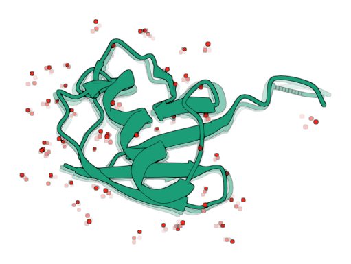

*`trails=True` also writes `exposure.png`: every frame accumulated with decay,
so smear length is the channel. The core holds its line; the tail and the
waters smear.*

The wander is **seeded**, so the same call gives the same sequence twice. Note
that each pose reloads the structure, which rebuilds the viewer's components —
so anything drawn outside a registered handle is gone when `boil()` returns.
The reply says so; redraw the view you had.

---

## The lens — projection and fog

```python
lens(projection="orthographic", fog=0)
```

Two stock Mol\* camera parameters, and between them most of the
technical-illustration look.

**`projection`** is `perspective` or `orthographic`. Perspective is a
photograph: nearer atoms draw larger and parallel lines converge. Orthographic
is a *drawing*: no convergence, and two atoms the same size are the same size
wherever they sit in depth. That is what makes it the projection of technical
illustration, and the one to reach for when a figure is meant to be *measured*
rather than looked at. A helix down its axis is honest in orthographic and
subtly tapered in perspective.

**`fog`** is 0 to turn it off, or 1–100 for how heavily the distance fades.

> **Fog has been on the whole time.** Mol\*'s default is on at 15, so every
> figure protean has ever produced carries it, and "no fog" is a change from
> the baseline rather than the baseline itself. Turning it off flattens the
> depth cue, which is often what a diagram wants.

It is depth-cueing rather than a filter: what fades is what is *far away*, so
orbiting changes which parts fade. Neither parameter carries data — fog's
channel is distance from the camera, a property of where you are standing
rather than of the molecule.

The reply is read back off the canvas rather than echoed, because Mol\* accepts
a malformed parameter group without complaint and keeps the old value.

---

## See also

- [Selections](selections.md) — choosing what to apply all of this to
- [The cookbook](cookbook.md) — these values in combination, for real tasks
- [Style reference](style-reference.md) — every representation, colour theme,
  lighting rig, shading style, material and background
- [Tool reference](tools.md) — the full argument list for each tool
