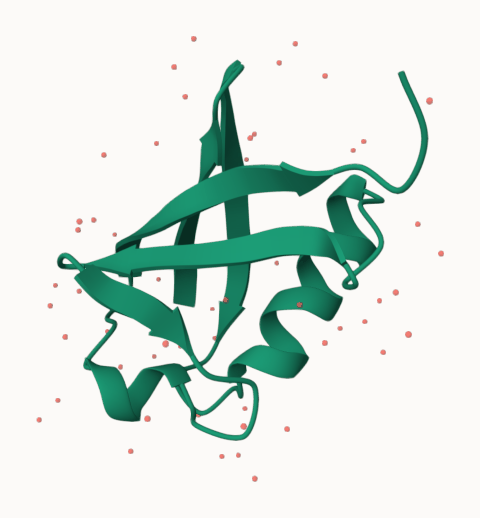
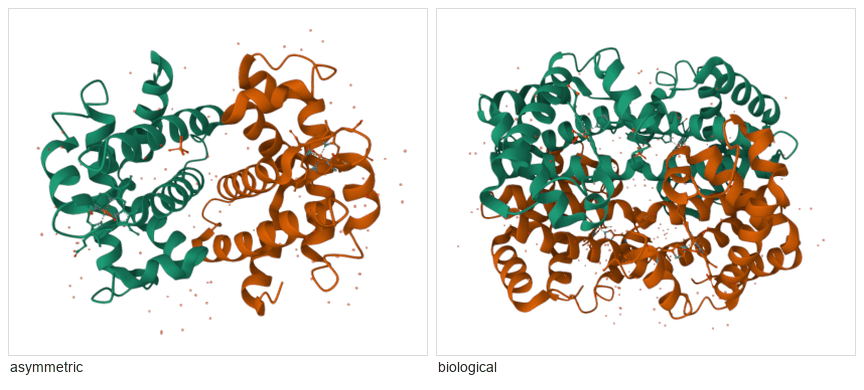

# Getting started

From nothing to a picture of a molecule. Fifteen minutes, most of it waiting
for `npm install`.

You do not need to be a structural biologist. Where this page uses a term of
art it defines it.

---

## What protean actually is

Three pieces, and it helps to know which is which when something goes wrong.

1. **An MCP server** — a Python program. Your AI assistant talks to it.
2. **A viewer** — a web page running [Mol\*](https://molstar.org), the
   molecular graphics program that does all the drawing. The server opens it in
   a browser tab and drives it over a local WebSocket.
3. **An analysis half** — more Python, which reads the same coordinates the
   viewer is drawing and answers questions with numbers.

You talk to the model. The model calls the server. The server moves the
picture, and reads the answer back off it.

**You are not expected to type any of the calls on this page.** They are shown
so you can see what the model is doing on your behalf, and so you can ask for
something specific when you want it.

---

## Before you start

| You need | Why | Check |
|---|---|---|
| **Python 3.11+** | the server | `python3 --version` |
| **Node 22** and npm | the viewer is built from source; 22 is what CI pins | `node --version` |
| **[uv](https://docs.astral.sh/uv/)** | dependency management | `uv --version` |
| **git** | there is no published package yet — see below | `git --version` |
| **A browser** | Chrome or Chromium is what this is tested against | — |

Optional, and each degrades one feature rather than breaking anything:

| Optional | Needed for | Without it |
|---|---|---|
| **ffmpeg** | `movie()` | frames are still written; nothing encodes them |
| **APBS** + **pdb2pqr** | `electrostatics(method="apbs")` | falls back to screened Coulomb, and says so |
| **Network** | fetching structures from RCSB, and `conservation()` | local files still load |

`capabilities()` reports which of these the running server can actually see, so
ask for that rather than guessing.

---

## Install

> **`uvx protean-mcp` does not work.** protean is not published to PyPI yet, and
> neither is its `wiggles-em` dependency. Installing from a clone is the only
> path that works today. If you have seen `uvx protean-mcp` written down
> somewhere, that instruction is wrong.

### 1. Clone and build

```bash
git clone https://github.com/chemrich/protean
cd protean

uv sync                              # the Python side
npm install --prefix viewer          # the viewer's dependencies
npm run build --prefix viewer        # build the viewer itself
```

`uv sync` pulls `wiggles-em` from GitHub — that is wired up in
`[tool.uv.sources]` in `pyproject.toml`, so `uv` finds it and `pip` would not.

**The viewer build is not optional.** It lands in `src/protean_mcp/static/`,
which is gitignored because it is a build artifact. Skip it and the server
starts happily, then `open_viewer` reports that the app is not built.

### 2. Point your assistant at it

**Claude Code**, from anywhere:

```bash
claude mcp add protean -- uv run --directory /absolute/path/to/protean protean-mcp
```

**Claude Desktop** — add to `claude_desktop_config.json`:

```json
{
  "mcpServers": {
    "protean": {
      "command": "uv",
      "args": ["run", "--directory", "/absolute/path/to/protean", "protean-mcp"]
    }
  }
}
```

Use an absolute path. `--directory` is what makes `uv` resolve protean's
environment rather than whatever project you happen to be sitting in.

### 3. Check it

Ask your assistant:

> What are protean's capabilities?

You should get back lists of representations, colour themes, lighting rigs and
presets, plus whether ffmpeg was found. That reply comes from the **live**
viewer registry rather than a hardcoded list, so if you see it, the whole chain
is working.

---

## Your first molecule

Say this:

> Open the protean viewer and load 1UBQ.

A browser tab opens, and a small protein appears in it.



*Ubiquitin (PDB `1UBQ`), exactly as `fetch_structure` leaves it. Two calls:
`open_viewer()` then `fetch_structure("1ubq")`.*

Some vocabulary, since it is all on screen already:

- **PDB ID** — a four-character code naming a structure in the
  [Protein Data Bank](https://www.rcsb.org). `1UBQ` is ubiquitin. protean also
  takes a UniProt accession like `P69905`, which fetches the
  [AlphaFold](https://alphafold.ebi.ac.uk) *predicted* model instead, and a
  local `.pdb` or `.cif` file path.
- **Cartoon** — the ribbon. It is a schematic of the backbone, not the atoms:
  flat arrows are **β-strands**, coils are **α-helices**, and the thin tube
  between them is loop.
- **Those red dots are water.** Crystallography resolves ordered water
  molecules and they are in the file. They are usually the first thing to hide.

The reply your model got back also said this:

```
Loaded 1ubq (mmcif, from cache): {'loaded': '1ubq', 'auto_components': 2,
'atom_count': 660, 'assembly': 'biological'}
[biological assembly, 660 atoms in both viewer and analysis]
```

That last clause is the point of the whole project: the viewer and the
analysis agree on how many atoms there are. When they disagree, the reply says
so instead of letting you ask questions about one molecule and get answers
about another.

### Biological assembly

**`assembly="biological"` is the default, and it is not always what the file
contains.** A crystal structure deposits the *asymmetric unit* — the piece the
crystal repeats. The molecule as it actually exists may be several copies of
that.



*Haemoglobin (`1HHO`). Left, the deposited coordinates: one αβ dimer. Right,
the molecule as it exists: the α₂β₂ tetramer. Same file, same call, one
argument different.*

It is not always larger — an asymmetric unit holding two copies of a complex
has an assembly *half* its size. Pass `assembly="asymmetric"` when you want the
deposited coordinates.

---

## Asking it something

> Show me the catalytic zinc site of carbonic anhydrase.


*`1CA2`. His94, His96 and His119 holding the zinc.*

What the model did:

```python
fetch_structure("1ca2")
preset("publication-cartoon")
select("byres (polymer within 5 of resn ZN) or resn ZN", name="site")
show(handle="site", representation="ball-and-stick", color="element-symbol")
focus("site")
```

The selection reads: *take the zinc, find every polymer atom within 5 Å of it,
widen that to whole residues, and add the zinc back.* That is
[the selection language](selections.md), and it is the one thing worth learning
if you want to ask for something precise.

The answer came back as data as well as a picture — 30 atoms, three residues,
each named. Ask for the numbers and you get them.

---

## Making a figure rather than a screenshot

```python
snapshot(path="figure.png", column="double", dpi=600)
```

`column="double"` is 183 mm — a journal's two-column width. The pixel count
follows from the width and the DPI, and **the resolution is written into the
file**, so it is still 183 mm wide when it lands in a document. A screenshot is
whatever size the window happened to be.

Use `screenshot()` when you just want to see the viewport, and `snapshot()`
when the image has to be a particular size.

---

## When it goes wrong

The three you are most likely to hit:

**"The viewer tab is hidden."** Browsers pause `requestAnimationFrame` in
background tabs, and Mol\* needs it to build representations. Bring the protean
tab to the front and retry. This is the single most common failure and it looks
like a hang.

**"The app is not built."** You skipped `npm run build --prefix viewer`, or you
pulled a change that touched the viewer and did not rebuild.

**`uvx protean-mcp` fails to resolve.** Expected — see
[Install](#install) above.

[troubleshooting.md](troubleshooting.md) has the rest, with the exact message
each one prints.

---

## Where to go next

- **[The cookbook](cookbook.md)** — worked recipes for the things people
  actually ask for, each with its picture.
- **[The gallery](gallery.md)** — what protean makes: views, presets, print
  finishes, the boil, the lens.
- **[Style reference](style-reference.md)** — every representation, colour
  theme, lighting rig, shading style and material, shown rather than listed.
- **[Selections](selections.md)** — how to say *which atoms*, exactly.
- **[Tool reference](tools.md)** — every tool, grouped and explained.
