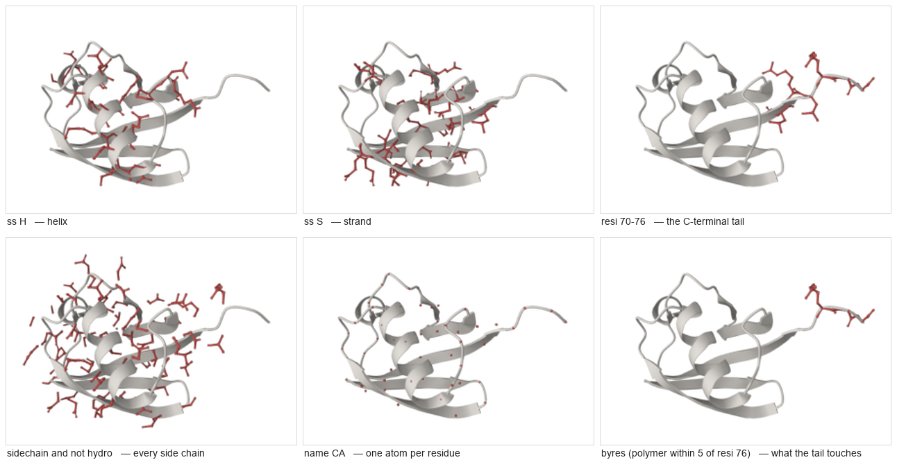

# Selections

A selection is how you say *which atoms*. Everything else in protean —
colouring, drawing, measuring, analysing — takes one.

protean uses PyMOL's syntax for the part PyMOL is good at, and moves the rest
into tools. This page is the complete reference: every keyword, every property,
every operator, and the things that are deliberately refused.

> **New to this?** Read the first two sections and stop. `chain A`,
> `resi 50-60`, `resn HIS` and `polymer` will carry you a long way, and
> [the cookbook](cookbook.md) has the rest by example.

Every atom count below is real, measured on the structure named. Reproduce them
with `select(...)` and compare.



*The same fold six times. The pale grey cartoon is the whole protein; the red
atoms are what each selection actually matched. Made by
[`docs/figures/make_figures.py`](figures/make_figures.py).*

---

## 1. The shape of a selection

```python
select("chain A and resi 50-60", name="loop")
```

Two things happen. The string is resolved against the coordinates protean holds
in Python, and the result is registered under a **handle** — here, `loop`. From
then on you pass the handle, not the string:

```python
show(handle="loop", representation="ball-and-stick")
color("#c0504d", name="loop")
focus("loop")
```

The handle is the point. A selection string is a *question*; a handle is the
*answer*, already computed. Analysis tools return handles too — `interface()`
hands back the residues it found — so the atoms a calculation identified are
the atoms you draw, with nobody re-deriving them from a description.

### Where the boundary is

PyMOL lets you build arbitrarily deep algebra inside the string. protean
deliberately does not. **Leaf predicates go in the string; composition goes in
the tools.**

| To do this | PyMOL | protean |
|---|---|---|
| Pick atoms by a property | `chain A and resi 50-60` | `select("chain A and resi 50-60", name="loop")` |
| Union / intersection / difference of two *named* sets | `sele1 or sele2` | `combine("union", of=["a", "b"], name="both")` |
| Everything within a distance of a named set | `byres (sele1 around 5)` | `near(of="a", radius=5, name="shell")` |
| Everything a named set excludes | `not sele1` | `invert(of="a", name="rest")` |

`and`, `or`, `not` and parentheses all work *inside* one string — see
[§5](#5-operators). What you cannot do is refer to a previously named handle by
name inside a new selection string. That is what `combine`, `near` and `invert`
are for, and it means there is no operator precedence to get wrong across a
composition you built over four calls.

### Nothing fails quietly

An unknown word is an error, never an empty result:

```
select("cartoon")
→ Unknown selection keyword: 'cartoon'. Supported keywords: all, alt, b,
  backbone, chain, elem, ...
```

This is the single most important design decision on this page.
[Mol\*'s own bundled PyMOL transpiler parses everything and answers several
common idioms with a silent empty set](../PLAN.md); a wrong answer nothing can
detect is worse than an error. So protean refuses anything it cannot compile
*correctly*, and says what it does support.

---

## 2. Class keywords

Words that take no argument. They name a class of atom.

| Keyword | Means | On 1UBQ (660 atoms) |
|---|---|---|
| `all` | every atom | 660 |
| `none` | no atoms | 0 |
| `polymer` | protein or nucleic chains | 602 |
| `protein` | amino-acid polymer only | 602 |
| `nucleic` | DNA/RNA polymer only | 0 |
| `solvent` | water | 58 |
| `hetatm` | anything not polymer | 58 |
| `backbone` | N, CA, C, O of the polymer | 305 |
| `sidechain` | polymer atoms that are not backbone | 297 |
| `hydro` | hydrogens | 0 |
| `metals` | metal ions | 0 |
| `organic` | small organic molecules — ligands | 0 |
| `inorganic` | small inorganic species | 0 |
| `glycan` | carbohydrate | 0 |
| `ion` | ions | 0 |

Ubiquitin is a small protein with no ligand, no metal and no hydrogens, which
is why so many of those are zero. On carbonic anhydrase (`1CA2`, 2207 atoms)
`metals` is 1 — the catalytic zinc — and on haemoglobin (`1HHO`, 4792 atoms)
`organic` is 172, the four haems.

**`glycan`, `ion` and `metals` are protean's own**, not PyMOL's. PyMOL makes
you name the element.

### Aliases

Accepted and identical to the word they stand for:

| Alias | Same as |
|---|---|
| `*` | `all` |
| `water` | `solvent` |
| `het` | `hetatm` |
| `org` | `organic` |
| `ino` | `inorganic` |
| `bb.` | `backbone` |
| `sc.` | `sidechain` |
| `h.`, `hydrogens` | `hydro` |
| `polymer.protein` | `protein` |
| `polymer.nucleic` | `nucleic` |
| `ligand` | `organic` |

---

## 3. Property selectors

Words that take one or more values. Values are joined with `+`, ranges with
`-`.

| Property | Selects by | Example | On 1UBQ |
|---|---|---|---|
| `chain` | chain identifier | `chain A` | 660 |
| `segi` | segment identifier | `segi A` | 660 |
| `resi` | residue number | `resi 50-60` | 89 |
| `resn` | residue name | `resn HIS` | 10 |
| `name` | atom name | `name CA` | 76 |
| `elem` | chemical element | `elem C` | 378 |
| `index` | atom serial from the file | `index 1-10` | 10 |
| `ss` | secondary structure | `ss H` | 148 |
| `rank` | position in the loaded array | `rank 0-9` | 10 |
| `sym` | which copy of the asymmetric unit | `sym 0` | 660 |
| `alt` | alternate conformer label | `alt ''` | 660 |

Aliases: `c.`=`chain`, `s.`/`segment`=`segi`, `i.`/`resid`=`resi`,
`r.`/`resname`=`resn`, `n.`=`name`, `e.`/`element`=`elem`, `idx.`=`index`.

```python
select("resn HIS+GLU")        # 64 atoms on 1UBQ — either residue name
select("resi 1+2+3")          # 25 atoms — three separate residues
select("resi 50-60")          # 89 atoms — an inclusive range
select("elem N+O")            # 281 atoms
```

### `ss` — secondary structure

**Computed with DSSP, not read from the file**, so it answers the same way for
a predicted model as for a deposited one.

| Value | Means | On 1UBQ |
|---|---|---|
| `ss H` | any helix | 148 |
| `ss S` | strand | 217 |
| `ss L` | loop | 237 |
| `ss alpha` | α-helix, 3.6 residues per turn | 98 |
| `ss 3-10` | the tighter 3₁₀ helix | 50 |
| `ss pi` | the rare wide π-helix | 0 |
| `ss extended` | DSSP's extended strand | 203 |
| `ss bridge` | isolated β-bridge | 14 |
| `ss turn` | hydrogen-bonded turn | 83 |
| `ss bend` | bend | 34 |

**A trap worth naming:** `ss S` means *strand*, following PyMOL. DSSP's own
letter `S` means *bend*. If you want bend, ask for `ss bend`.

### `sym` — copies in a biological assembly

Loaded as a biological assembly, haemoglobin is an α₂β₂ tetramer with two
chains called A. `chain A` means **every copy** of that chain; `chain A and
sym 0` is one subunit.

```python
select("sym 0")     # 1HHO: 2396 atoms — half of the 4792-atom assembly
```

Refused on a structure loaded as the asymmetric unit, which has only one copy:

```
select("sym 0")   # on an asymmetric-unit load
→ 'sym' names a copy of the asymmetric unit, and this structure holds the
  asymmetric unit itself...
```

Watch for this: on 1HHO's assembly, `index 1-10` matches **20** atoms, not 10 —
each copy carries the same serial numbers.

### `alt` — alternate conformers

An atom resolved in more than one position carries a label. `alt A` means
exactly the atoms labelled `A`, as PyMOL does — usually a side chain with no
backbone, because only the atoms that actually differ are labelled.

- **The whole conformer is `alt ''+A`** — the shared atoms plus that letter.
- `alt ''` and `alt .` both mean "no alternate".
- The labels are disjoint, so `alt A and alt B` is empty.

On a structure with no alternates at all, asking for one is refused rather than
returning nothing:

```
select("alt A")   # on 1UBQ
→ 'alt' names an alternate conformer, and no atom in this structure has one...
```

**Analysis tools do not use `alt`.** They resolve one conformer state on their
own — the one carrying the most occupancy — because the states never coexist.
See [alternate-conformers.md](alternate-conformers.md).

---

## 4. Numeric comparisons

Two properties are numbers rather than labels, and take a comparison instead of
a value list: `b` (B-factor, or whatever occupies that column) and `q`
(occupancy).

Operators: `>`, `<`, `>=`, `<=`, `=`, `!=`.

```python
select("b > 30")             # 1UBQ: 60 atoms
select("b < 10")             # 1UBQ: 291 atoms
select("q < 1")              # 1UBQ: 57 atoms — partial occupancy
select("polymer and b > 40") # 1UBQ: 4 atoms
select("ss H and b > 20")    # 1UBQ: 24 atoms — mobile helix
```

**On a predicted model the `b` column is pLDDT, not a B-factor**, and the
meaning inverts: high is *confident*, where a high B-factor is *uncertain*.
protean tracks which one was loaded and refuses to colour by the wrong reading
— see `color()`'s note on `uncertainty` versus `plddt`.

---

## 5. Operators

Loosest to tightest binding:

```
or_expr   := and_expr (('or' | '|') and_expr)*
and_expr  := unary (('and' | '&') unary)*
unary     := ('not' | '!') unary | modifier unary | postfix
postfix   := primary (spatial_op)*
spatial_op:= 'within' DIST 'of' primary | 'around' DIST | 'expand' DIST
primary   := '(' or_expr ')' | property_sel | keyword_sel
```

`and`/`&`, `or`/`|` and `not`/`!` are interchangeable. Parentheses group.

```python
select("chain A and not solvent")
select("polymer & backbone")
select("resn HIS or resn GLU")
```

### Spatial operators

`DIST` is in ångströms and must be greater than zero.

| Form | Means | On 1UBQ |
|---|---|---|
| `X within D of Y` | atoms of `X` within `D` Å of any atom of `Y` | `polymer within 5 of resn HOH` → 372 |
| `X around D` | atoms within `D` Å of `X`, **excluding `X` itself** | `resi 50 around 5` → 49 |
| `X expand D` | `X` **plus** everything within `D` Å of it | `resi 50 expand 5` → 57 |

`around` and `expand` differ by exactly the 8 atoms of residue 50.

### Modifiers

Applied to the selection that follows.

| Modifier | Means | On 1UBQ |
|---|---|---|
| `byres` | widen to every atom of each matched residue | `byres (resi 50)` → 8 |
| `bychain` | widen to every atom of each matched chain | `bychain (resi 50)` → 660 |
| `bymolecule` | widen to every atom of each matched molecule | `bymolecule (resi 50)` → 602 |
| `neighbor` | atoms bonded to the selection, excluding it | `neighbor (resi 50)` → 2 |
| `bound_to` | same as `neighbor` | `bound_to (resi 50)` → 2 |
| `first` | the first atom of the selection | `first (chain A)` → 1 |

**`byres` is the one you will reach for constantly.** A distance search returns
atoms; you almost always want the residues those atoms belong to:

```python
select("byres (polymer within 5 of resn ZN)", name="site")   # 1CA2: 46 atoms
select("byres (polymer within 2.6 of metals)", name="coord") # 1CA2: 30 atoms
```

That second one is the catalytic zinc site of carbonic anhydrase: His94, His96
and His119, 30 atoms — the same answer PyMOL gives, and
[the benchmark](benchmark.md) shows both.

`expand` walks the bond graph and is capped at a depth of 64, so a typo cannot
hang the server.

---

## 6. What is refused, and why

These parse but are explicitly not evaluated. Each names its reason rather than
returning nothing:

| Construct | Message |
|---|---|
| `last` | no last-element filter; `first` is available |
| `pepseq` | sequence-motif matching not yet implemented |
| `like` | not implemented |
| `beyond` | not implemented |
| `near_to` | not implemented |

Malformed input is refused with the position or the expectation:

```
select("chain")        → Expected a value after the selector
select("(chain A")     → Unbalanced parenthesis
select("chain A and")  → Unexpected end of selection
select("resi 50-")     → Expected an integer, range, or insertion code, got '50-'
select("polymerr")     → Unknown selection keyword: 'polymerr'. Supported keywords: ...
```

### Gaps against PyMOL

[docs/benchmark.md](benchmark.md) is candid that PyMOL's selection grammar has
no gaps where protean's has several. The ones above are the list. If you need
`pepseq` or `beyond`, protean cannot express it today; say so rather than
working around it silently.

---

## 7. Composing across calls

The tools that take handles rather than strings:

```python
select("chain A", name="a")
select("chain B", name="b")

combine("union", of=["a", "b"], name="ab")        # union | intersect | subtract
near(of="a", radius=5, name="shell")              # what is near A
near(of="a", radius=5, whole_residues=False,
     exclude_self=False, name="raw")              # atoms, including A's own
invert(of="a", name="not_a")                      # everything A is not

list_selections()                                 # what is registered
remove(name="raw")                                # forget one
```

`near()` defaults to whole residues and to excluding the source set — which is
`byres (a around D)`, the thing you nearly always mean.

---

## See also

- [Getting started](getting-started.md) — install, and your first picture
- [The cookbook](cookbook.md) — selections in context, with figures
- [Tool reference](tools.md) — every tool and its arguments
- [Alternate conformers](alternate-conformers.md) — the `alt` story in full
- [Symmetry handles](symmetry-handles.md) — the `sym` story in full
