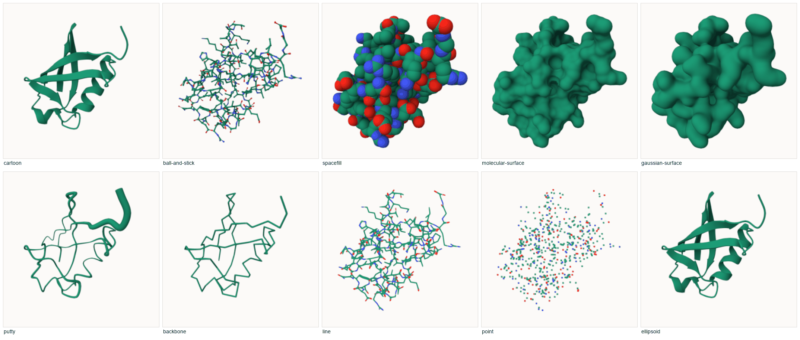
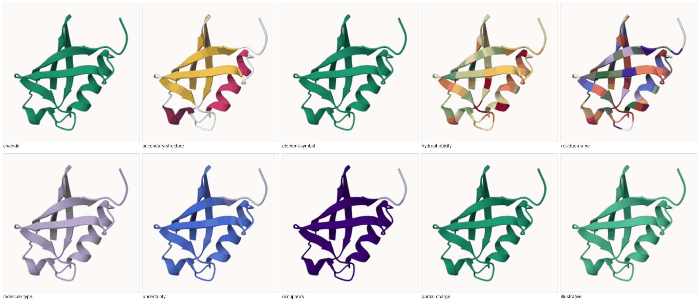
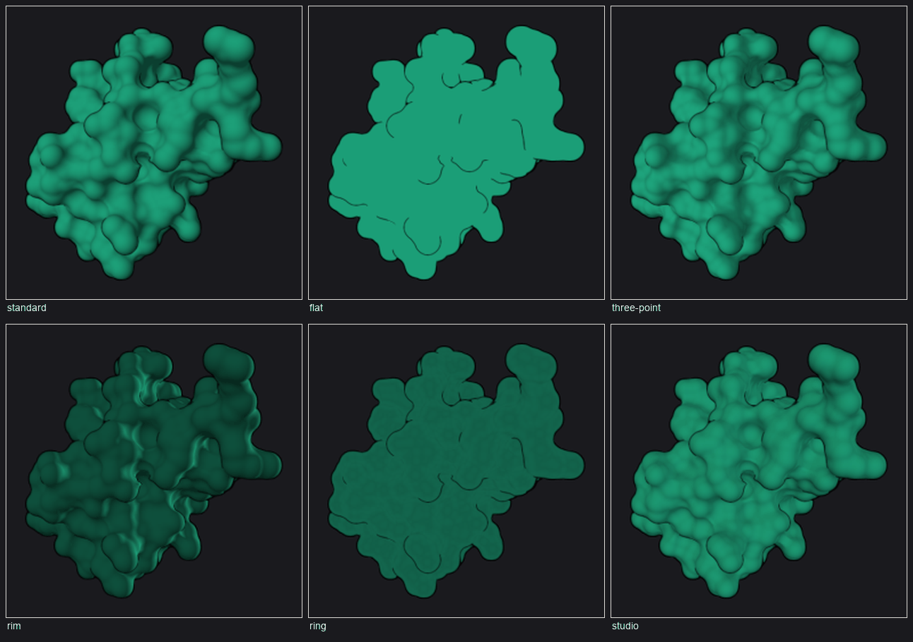
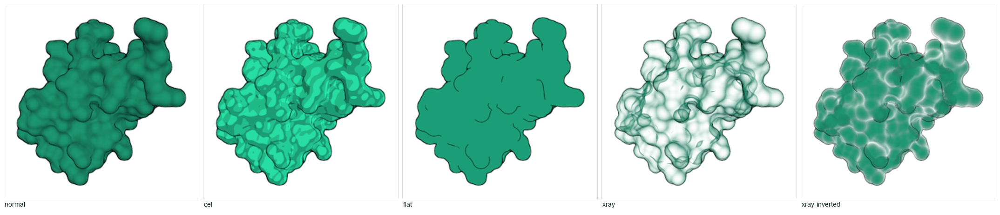
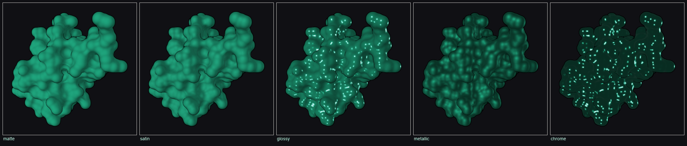
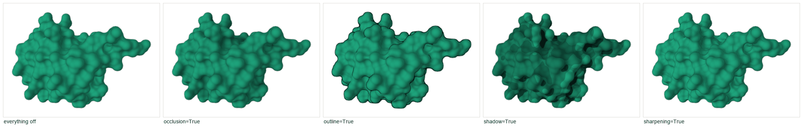

# Style reference

Every value you can pass to a display tool, shown rather than listed.

`capabilities()` reports the live lists off the running viewer — that is the
authority, and it will include anything a newer Mol\* has added. This page is
the same lists with pictures attached.

Most of what is here is Mol\*'s own vocabulary, exposed rather than invented.
For what protean *makes* — the one-call views, the presets, the print finishes,
the boil — see **[the gallery](gallery.md)**.

Every figure here is regenerated by
[`docs/figures/make_figures.py`](figures/make_figures.py), from the tool calls
printed beside it.

---

## Representations — the shape

```python
show(selection="polymer", representation="cartoon")
```



24 are registered. These ten are the ones worth knowing:

| Name | What it draws | Reach for it when |
|---|---|---|
| `cartoon` | ribbon schematic of the backbone | almost always — the default |
| `ball-and-stick` | atoms and bonds | showing a site, a ligand, a few residues |
| `spacefill` | one sphere per atom at its van der Waals radius | showing bulk and packing |
| `molecular-surface` | the surface a solvent probe can reach | showing shape, pockets, what a ligand meets |
| `gaussian-surface` | a smoother, cheaper surface | large structures where the exact surface costs too much |
| `putty` | a tube whose width follows B-factor | showing which parts are mobile |
| `backbone` | a plain trace | context behind something else |
| `line` | thin bonds, no spheres | dense scenes where sticks would fill the frame |
| `point` | one dot per atom | very large structures |
| `ellipsoid` | anisotropic displacement, where the file has it | crystallography at high resolution |

The rest — `carbohydrate`, `interactions`, `label`, `plane`, `orientation`,
`membrane-orientation`, `ntc-tube`, `confal-pyramids`, `polyhedron`,
`cross-link-restraint`, `rcsb-clashes`, and Mol\*'s MVS annotation visuals —
are specialised, and most want data a typical entry does not carry. An unknown
name is refused with the full list.

---

## Colour themes — the meaning

```python
show(selection="polymer", representation="cartoon", color="hydrophobicity")
color("secondary-structure", name="sele")
```



51 themes are registered. A theme paints by a *property*; a hex value like
`"#3366cc"` paints flat.

| Theme | Colours by |
|---|---|
| `chain-id` | which chain — the first thing to try on a complex |
| `secondary-structure` | helix, strand, loop |
| `element-symbol` | carbon, nitrogen, oxygen… the usual chemistry colours |
| `hydrophobicity` | how greasy each residue is |
| `residue-name` | one colour per amino acid |
| `molecule-type` | protein vs nucleic vs ligand vs water |
| `uncertainty` | the B-factor column — how sure the experiment is |
| `plddt` | the same column read as a *predicted* model's confidence |
| `occupancy` | how much of the crystal has the atom in that position |
| `partial-charge` | computed atomic charge |
| `illustrative` | flat cel-shaded colour, for a diagram |

**`uncertainty` and `plddt` are the same column read two ways, and they run in
opposite directions.** High B-factor means *less* certain; high pLDDT means
*more* confident. protean tracks which one was loaded and **refuses** the wrong
one rather than drawing a plausible picture with its ramp reversed.

---

## Lighting rigs

```python
lighting(rig="three-point")
```



| Rig | What it does |
|---|---|
| `standard` | Mol\*'s own single key light. The way back. |
| `flat` | no directional light at all — even and shadowless, for a schematic |
| `three-point` | key, fill and back. Form from the key, shadows opened by the fill |
| `rim` | weak key, strong back. Silhouette first; poor for surface detail |
| `ring` | six lights on a circle. Soft, nearly shadowless |
| `studio` | warm key against a cool fill, low contrast. Photographic |

Lighting only shows on something with form. On a flat cartoon most of these
look the same, which is why the figure uses a surface.

---

## Shading styles

```python
shading(style="cel", name="sele")
```



| Style | What it does |
|---|---|
| `normal` | Mol\*'s own shading. The way back. |
| `cel` | banded, cartoon-like. Pair with `effects(outline=True)` |
| `flat` | unlit flat colour — a diagram rather than a picture |
| `xray` | see-through with the edges picked out. Cheaper and cleaner than opacity for showing what is inside |
| `xray-inverted` | inverts which parts fade: the facing surface goes, the rim stays |

---

## Material finishes

```python
material(finish="glossy", name="sele")
```



Dull to sharp: `matte` · `satin` · `glossy` · `metallic` · `chrome`.
`metallic` takes the highlight from the surface colour; `chrome` reflects the
background, so it wants a `skybox` to reflect.

`material()` also takes `metalness`, `roughness`, `emissive`, `bumpiness` and
`bump_frequency` directly, when a named finish is not what you want.

---

## Screen-space effects

```python
effects(outline=True, occlusion=True)
```



Anything omitted is left exactly as it is, so these compose across calls.

| Effect | What it does |
|---|---|
| `occlusion` | ambient occlusion — darkens crevices, so pockets read as recessed. **The single biggest gain in legibility for a surface.** |
| `outline` | a line around the silhouette and interior edges — the textbook look |
| `shadow` | cast shadows. Cheap and blunt; occlusion usually reads better |
| `depth_of_field` | blur what is not at the camera's focus |
| `bloom` | glow around bright things; only visible on emissive material |
| `sharpening` | contrast-adaptive sharpening, worth a little at high DPI |

---

## Backgrounds

```python
background(color="#ffffff")
background(gradient="radial", gradient_from="#20242c", gradient_to="#05060a")
background(transparent=True)
background(image="poster.jpg", blur=0.4)
background(skybox="cubemap/")
```

`gradient`, `image` and `skybox` are the same slot in Mol\*, so at most one
applies at a time. A skybox surrounds the scene rather than sitting behind it,
so it also shows in reflections off a `metallic` or `chrome` material.

`transparent=True` also switches the capture pipeline to transparent output —
a separate flag in Mol\*, which would otherwise keep returning opaque PNGs.

---

## See also

- [The gallery](gallery.md) — what protean makes with these
- [Tool reference](tools.md) — the full argument list for each tool
- [Cookbook](cookbook.md) — worked recipes, each with its figure
